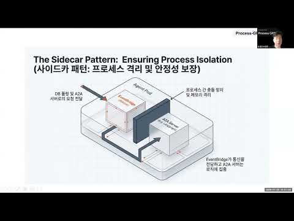
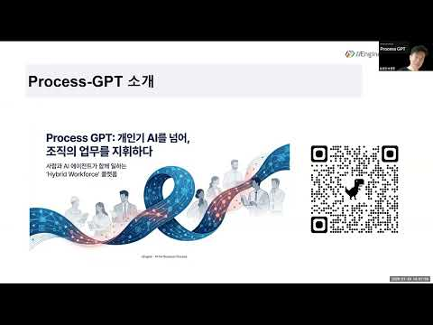
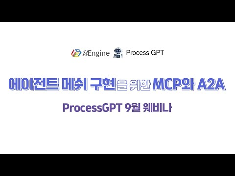
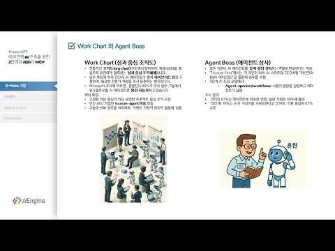
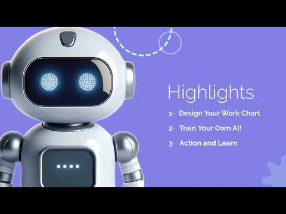
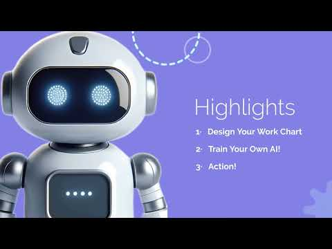
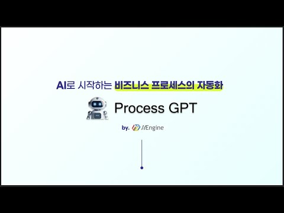
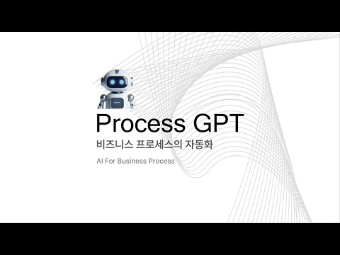
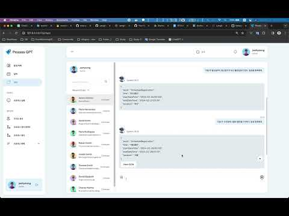
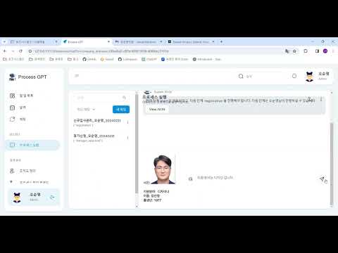

## Process GPT Project
**A BPMN-based Multi-Agent Orchestration Framework for the Enterprise**


Process GPT is an open-source platform that combines the 30-year-proven BPMN (Business Process Model and Notation) international standard with the autonomy of modern AI agents. It lets non-technical users design business processes in natural language, lets multiple specialized agents collaborate to execute them, and continuously learns from feedback to make every future run better.

Where classic BPM requires code and specialists, and pure agent frameworks (CrewAI, LangGraph, AutoGen, Swarm/OpenAI SDK) leave you without visual processes, audit trails, or compensation semantics — Process GPT sits at the intersection: **visual + code + standards-based, engineered for production**.

**Online Service**
🌐 [www.process-gpt.io](http://www.process-gpt.io)

## Process-GPT Related Videos

[![대화로 HWPX 문서를 생성하고 편집하는 [ProcessGPT]](docs/thumbnails/HpcG2IV9nqA.jpg)](https://youtu.be/HpcG2IV9nqA) [![HWPX 문서를 생성하는 AI [ProcessGPT]](docs/thumbnails/jigU-3CY87Y.jpg)](https://youtu.be/jigU-3CY87Y) [![나노바나나 기반 슬라이드 생성 [ProcessGPT]](docs/thumbnails/SVrVh_YrF7U.jpg)](https://youtu.be/SVrVh_YrF7U)

[](https://youtu.be/QXS-tL8raqM) [](https://youtu.be/t28gqnPyofg) [![Agent Ops 구현 미리보기 - [Process GPT] 휴먼-에이전트 성과 분석](docs/thumbnails/GZ8WY8LSgeA.jpg)](https://youtu.be/GZ8WY8LSgeA)

[](https://youtu.be/kq4IiPDngQw) [](https://youtu.be/eyME6A6K9CM) [](https://youtu.be/KBxxQvxvmPo)

[](https://youtu.be/kd6_hKSQDYc) [![[Process-GPT] AI를 이용한 비즈니스 프로세스 / 폼 자동 생성](docs/thumbnails/DI4vLwijsMs.jpg)](https://youtu.be/DI4vLwijsMs) [](https://youtu.be/pUiFodjImcc)

[](https://youtu.be/U_21lPKoGOI) [](https://youtu.be/UA7kYEk4sAk) [](https://youtu.be/mRTGKSd8Jhg)

---

### Why Process GPT

*   **Flexible and Robust Collaboration via Multi-Agent Systems** — Process GPT configures **multiple AI agents to collaborate within a single BPMN-based business process**, so that multiple agent frameworks can professionally handle complex tasks and share intermediate results. This reliably automates high-complexity work that would be difficult for a single agent. Each agent leverages specialized domain knowledge and tools, and can automatically call upon other specialized agents to delegate tasks when necessary.

*   **Automated Business Process Generation** — Process GPT is designed to let **AI agents automatically define business processes**, producing results without constant human instruction or manual execution of every step. This minimizes human intervention, embodying the *ambient agent* philosophy, and ensures that human involvement does not become a bottleneck.

*   **Natural-Language-Based Continuous Process Learning and Optimization** — Non-expert users can **define business processes using natural language**, which automatically generates initial process models. An **automatic optimization cycle** analyzes user feedback and agent execution logs, continuously improving processes and augmenting training data for workflows that need correction.

*   **Deterministic Regularization of AI Decisions** — When agents repeatedly make the same kind of judgment, Process GPT automatically converts it into a **DMN decision table or Python rule**, guaranteeing that "same input = same output" for enterprise-critical paths while keeping AI flexibility for exceptions.

*   **Enterprise-Grade Reliability** — BPMN Compensation Events provide automatic rollback and compensating transactions on failure. Human-in-the-Loop is a native BPMN pattern, not a workaround. Every step is auditable against an ISO/IEC 19510 process model.

---

### What's Under the Hood

*   **Framework-agnostic Multi-Agent System** — powered by LangChain Deepagents, CrewAI, and more; pick the best runtime per task
*   **BPMN-based Hybrid Process Execution** — deterministic (DMN/code) and stochastic (LLM reasoning) modes in one diagram
*   **Collaborative Work via the Agent-to-Agent (A2A) Protocol** — agents discover and negotiate with each other through Agent Cards
*   **Isolated Agent/Tool Execution** — each MCP and A2A server runs in its own container, orchestrated on Kubernetes with KEDA queue-based autoscaling and a Sidecar isolation pattern
*   **Skill Self-Learning & Feedback Loops** — agents improve their own Skills through a Think → Execute → Reflect cycle driven by user feedback
*   **Context Engineering** — Mem0 + Neo4j knowledge graph + Memento RAG service give agents deep organizational context
*   **Voice & Realtime Channels** — GPT-4 Realtime API + Twilio PSTN integration for voice-driven process triggers
*   **Process Marketplace** — share and reuse verified process templates across teams and organizations
*   **Integrations** — Browser-use, OpenAI Deep Research, Supabase (Postgres, Realtime, Storage, Auth), ERP/CRM via MCP, N8n *(coming soon)*

---

### Core Architecture (5 Layers)

| Layer | Role | Key Components |
|---|---|---|
| **UI & Gateway** | User entry & routing | Vue 3 Frontend, React Voice Agent, Nginx / Spring Cloud Gateway |
| **Core Process** | BPMN definition, instance lifecycle, polling | Execution Engine (FastAPI), Polling Service |
| **Knowledge & RAG** | Document parsing, embedding, retrieval | Memento (Supabase vector DB, Google Drive ingestion) |
| **AI Agents** | Task execution | CrewAI Action, CrewAI Deep Research, OpenAI Deep Research, Browser-Use, BPMN Extractor |
| **Infrastructure** | State, events, storage, auth | Supabase (Postgres, Realtime, Storage, Auth), Docker Compose / Kubernetes |

---

### Where Process GPT Sits in the Market

Process GPT is the only player in the **"BPMN + AI Hybrid"** category — purpose-built for enterprises that need the governance of BPM and the autonomy of modern agents at the same time.

| | ProcessGPT | CrewAI / LangGraph / AutoGen | Dify.ai / n8n | Google ADK / AWS Bedrock |
|---|---|---|---|---|
| **Orchestration** | **BPMN visual modeling** | Code-based roles/graphs | Visual low-code | Console / blueprint |
| **Determinism** | **DMN + Python auto-conversion** | None | Conditional nodes | Guardrails only |
| **Agent-to-Agent** | **A2A + event-driven** | Sequential / group chat | N/A | A2A (Google) / internal |
| **Self-learning** | **Skills + feedback loop** | Memory only | None | None |
| **Compensation** | **BPMN Compensation Events** | None | Basic error branches | None |
| **Autoscaling** | **KEDA + Sidecar** | Manual | Manual | Managed (vendor-locked) |
| **Non-developer access** | **High (NL + visual)** | Low (code) | High | Medium |
| **Deployment** | **Open source, multi-cloud, on-prem** | Library-level | SaaS / self-host | Cloud-locked |

---

### Who It's For

*   **Enterprises modernizing legacy BPM** — keep your BPMN assets, add AI autonomy
*   **Regulated industries** — finance, healthcare, public sector where audit trails and compliance are non-negotiable
*   **Citizen developers** — business users automating their own work in natural language, no coding required
*   **AI teams building production agents** — skip the infrastructure rebuild; get K8s-native isolation, scaling, and observability out of the box

---

### Get Started

*   **Website:** [process-gpt.io](https://www.process-gpt.io)
*   **Documentation:** [docs.process-gpt.io](https://docs.process-gpt.io)
*   **SaaS:** try it instantly at [process-gpt.io](https://process-gpt.io)
*   **Self-host:** `docker compose up` deploys the full stack; Kubernetes manifests included for production

> *Process GPT creates a new category — "the BPMN of AI agents" — and sets the standard for enterprise multi-agent orchestration.*

Maintained by **uEngine Solutions** · learning@uengine.org


---

## Subprojects

* **execution** (Execution Engine): [GitHub](https://github.com/uengine-oss/process-gpt-execution)
* **memento** (Document Memory Storage): [GitHub](https://github.com/uengine-oss/process-gpt-memento)
* **crewai-action** (MCP / Multi-Agent Task Execution Agent): [GitHub](https://github.com/uengine-oss/process-gpt-crewai-action)
* **crewai-deep-research** (Multi-Agent Deep Research Agent): [GitHub](https://github.com/uengine-oss/process-gpt-crewai-deep-research)
* **openai-deep-research** (OpenAI-based Deep Research Agent): [GitHub](https://github.com/uengine-oss/process-gpt-openai-deep-research)
* **react-voice-agent** (Voice Interaction Agent): [GitHub](https://github.com/uengine-oss/process-gpt-react-voice-agent)
* **API gateway**: [GitHub](https://github.com/uengine-oss/process-gpt-gateway)
* **frontend**: [GitHub](https://github.com/uengine-oss/process-gpt-vue3)
* **completion**: [GitHub](https://github.com/uengine-oss/process-gpt-completion)
* **autonomous-execution**: [GitHub](https://github.com/uengine-oss/process-gpt-autonomous-execution)
* **agents.github.io**: [GitHub](https://github.com/uengine-oss/process-gpt-agents.github.io)
* **generic-agent**: [GitHub](https://github.com/uengine-oss/process-gpt-generic-agent)
* **agent-feedback**: [GitHub](https://github.com/uengine-oss/process-gpt-agent-feedback)
* **mcp-validator**: [GitHub](https://github.com/uengine-oss/process-gpt-mcp-validator)
* **agent-sdk**: [GitHub](https://github.com/uengine-oss/process-gpt-agent-sdk)
* **langchain-react**: [GitHub](https://github.com/uengine-oss/process-gpt-langchain-react)
* **a2a-orch**: [GitHub](https://github.com/uengine-oss/process-gpt-a2a-orch)
* **agent-utils**: [GitHub](https://github.com/uengine-oss/process-gpt-agent-utils)
* **bpmn-extractor** (ProcessGPT BPMN extractor from PDFs): [GitHub](https://github.com/uengine-oss/process-gpt-bpmn-extractor)
* **computer-use**: [GitHub](https://github.com/uengine-oss/process-gpt-computer-use)
* **claude-skills** (MCP server for searching and retrieving Claude Agent Skills using vector search): [GitHub](https://github.com/uengine-oss/process-gpt-claude-skills)
* **deep-research**: [GitHub](https://github.com/uengine-oss/process-gpt-deep-research)
* **office-mcp**: [GitHub](https://github.com/uengine-oss/process-gpt-office-mcp)

### Syster(Related) Projects
* **Robo Architect**: [GitHub](https://github.com/uengine-oss/robo-architect)

---

## Design Principles

### Design Principles
**Users should be able to declare and modify processes, rules, system integration mechanisms, etc. in natural language, and the system should automatically improve with minimal feedback provided during use.**

All such changes must be **logged for tracking and recovery**, while users should simultaneously be able to directly control automation results and regulations through a **generalized UI** at any time.

---

### Principle 1. **Natural Language-Centric Definition and Training-Free Operation**
- All **process definitions, rules, system integrations, and business interfaces** should be writable in **natural language** without requiring programming knowledge or complex logical/mathematical thinking.
- Users should be able to design automation with **business objective or strategic-level descriptions** alone, without undergoing separate training processes.
- The system should be progressively refined and managed through **minimal feedback (approval, modification, rejection)** provided during actual use.

---

### Principle 2. **Human-in-the-Loop and Learning by Example**
- Automated agents must provide **human interfaces** that allow **people to substitute and perform tasks** at any time.
- Each task should provide **necessary context (related data, previous step outputs, similar cases)** in a clear and organized manner to facilitate human processing.
- Agents learn from **actual performance examples** where humans directly handle tasks, correcting and improving their execution knowledge. In other words, **human exemplars** become the agent's training data.

---

### Principle 3. **Automatic Compensation and Separation of Recovery Responsibility**
- When errors or failures occur in automated processes performed by agents, recovery should be automatically implemented through **compensating transactions (rollback)**.
- Operators should not need to track and correct agent details individually; **the system itself should take responsibility for failure recovery and processing**.
- This liberates users from system imperfections and ensures overall business continuity.

--- 


## Process-GPT Local Installation Guide (Kind)

Please refer to the [Local Installation Guide](docs/local-installation-guide.md).


---

## User Manual
📖 [Process-GPT User Manual](https://docs.process-gpt.io/)

---

# Process-GPT 로컬 개발 환경 구축 공식 온보딩 가이드

> 이 문서는 Process-GPT를 처음 접하는 개발자가 **다시 위로 올라가서 확인할 필요 없이**
> 처음부터 끝까지 순차적으로 따라가며
> **단 하나의 명령어도 누락 없이**
> 로컬 개발 환경을 완성할 수 있도록 작성된 공식 온보딩 가이드입니다.

---

## 0. 반드시 이 문서를 처음부터 끝까지 읽어야 하는 이유

Process-GPT는 단일 애플리케이션이 아닙니다.  
다음과 같은 **다중 서비스 + 다중 기술 스택**이 정확한 순서와 설정으로 연결되어야 정상 동작합니다.

- Frontend (Vue3 + Vite)
- Gateway (Spring Boot, JWT 인증)
- Completion Service (Python + OpenAI)
- Polling Service (비동기 이벤트 처리)
- Memento Service (메모리/컨텍스트 저장)
- Supabase (Auth + PostgreSQL + Storage)
- Docker 기반 로컬 인프라

👉 **하나라도 누락되면**  
로그인 실패, 401 오류, Completion 무응답, 메모리 저장 실패가 발생합니다.

---

## 1. 전체 아키텍처 개요

```
[Browser]
   ↓
[Vue3 Frontend]
   ↓
[Spring Boot Gateway]  ← JWT 검증 기준점
   ↓
[Completion Service] ←→ [Polling Service]
   ↓
[Memento Service]
   ↓
[Supabase (Auth + DB)]
```

- Gateway는 모든 요청의 **단일 진입점**
- JWT Secret이 Gateway와 Supabase 간 불일치 시 전체 시스템 실패

---

## 2. Repository 준비 (절대 생략 불가)

### 2-1. 작업 디렉토리 생성

```bash
mkdir process-gpt
cd process-gpt
```

### 2-2. Repository Clone

```bash
git clone https://github.com/uengine-oss/process-gpt-vue3
git clone https://github.com/uengine-oss/process-gpt-completion
git clone https://github.com/uengine-oss/process-gpt-memento
```

⚠️ 반드시 **같은 상위 디렉토리**에 존재해야 합니다.

---

## 3. Frontend (process-gpt-vue3) 설정

### 3-1. Node.js 버전 확인

```bash
node -v
```

- **권장 버전:** `v18.17.0`
- 다른 버전 사용 시:
  - Vite 실행 오류
  - dependency 충돌
  - build 실패 가능성

---

### 3-2. 기존 Node 삭제가 필요한 이유 (Windows)

- `nvm`은 Node를 관리하는 도구
- OS에 직접 설치된 Node가 있으면 **PATH 충돌 발생**
- 반드시 기존 Node 제거 필요

**경로**
- 제어판 → 프로그램 제거 → Node.js 삭제

---

### 3-3. nvm 설치

#### Windows
https://github.com/coreybutler/nvm-windows/releases  
→ `nvm-setup.exe` 실행

#### macOS
```bash
curl -o- https://raw.githubusercontent.com/nvm-sh/nvm/v0.39.7/install.sh | bash
```

---

### 3-4. Node 18.17.0 설치

```bash
nvm install 18.17.0
nvm use 18.17.0
node -v
```

---

### 3-5. Frontend 의존성 설치

```bash
cd process-gpt-vue3
npm install
```

---

## 4. Supabase 로컬 환경 구축 (Docker 기반)

### 4-1. Docker Desktop 설치

https://www.docker.com/get-started/

Docker Desktop은 **반드시 실행 중**이어야 합니다.

---

### 4-2. Supabase 초기화

```bash
cd process-gpt-vue3
npx supabase init
```

---

### 4-3. Supabase 실행

```bash
cd supabase
npx supabase start
```

정상 실행 시 다음 정보 출력:
- Studio URL
- API URL
- anon key / service key
- JWT Secret

---

### 4-4. DB 초기 스키마 로딩 (필수)

**파일 위치**
```
process-gpt-vue3/docker-compose/volumes/db/init.sql
```

**절차**
1. Supabase Studio 접속
2. SQL Editor 열기
3. `init.sql` 전체 복사 → 실행

⚠️ 이 단계 누락 시 **DB 오류 100% 발생**

---

## 5. Frontend 실행

```bash
cd process-gpt-vue3
npm run dev
```

브라우저에서 출력된 `localhost` 포트 접속

---

## 6. Gateway (Spring Boot) 설정

### 6-1. JDK 설치

```bash
choco install openjdk11 -y
```

### 6-2. Maven 설치

```bash
choco install maven -y
```

확인:

```bash
java -version
mvn -v
```

---

### 6-3. JAVA_HOME 설정 (중요)

```bash
where java
```

예:
```
C:\Program Files\Eclipse Adoptium\jdk-11.0.x\bin\java.exe
```

**환경변수 설정**
- JAVA_HOME = `C:\Program Files\Eclipse Adoptium\jdk-11.0.x`
- Path에 `%JAVA_HOME%\bin` 추가

---

### 6-4. Visual C++ Build Tools 설치

https://visualstudio.microsoft.com/ko/visual-cpp-build-tools/

✔ **"C++를 사용한 데스크톱 개발"** 선택

---

### 6-5. JWT Secret 설정 (가장 중요)

Supabase 실행 시 출력된 JWT Secret 확인 후 수정

**파일**
```
gateway/src/main/java/.../ForwardHostHeaderFilter.java
```

```java
private static final String SECRET_KEY =
    Optional.ofNullable(System.getenv("SECRET_KEY"))
    .orElse("SUPABASE_JWT_SECRET");
```

❌ 다를 경우:
- 로그인 실패
- 모든 API 401

---

### 6-6. Gateway 실행

```bash
cd process-gpt-vue3/gateway
mvn spring-boot:run
```

---

## 7. Completion Service 설정

### 7-1. Python 설치

- 권장 버전: **Python 3.12.0**
- https://www.python.org/downloads/

---

### 7-2. 가상환경 생성

```bash
cd process-gpt-completion
uv venv --python 3.12.0
uv pip install -r requirements.txt
source .venv/Scripts/activate
```

---

### 7-3. `.env` (main.py)

```env
ENV=local
OPENAI_API_KEY=YOUR_KEY

SUPABASE_URL=
SUPABASE_KEY=

DB_HOST=127.0.0.1
DB_PORT=54322
DB_NAME=postgres
DB_USER=postgres
DB_PASSWORD=postgres
```

---

### 7-4. polling_service `.env`

⚠️ 루트 + polling_service 내부 **2개 생성 필수**

```env
ENV=localhost
OPENAI_API_KEY=

SUPABASE_URL=
SUPABASE_KEY=

MEMENTO_SERVICE_URL=http://localhost:8005
COMPLETION_SERVICE_URL=http://localhost:8000
```

---

### 7-5. Completion 실행

```bash
python main.py
```

새 터미널:

```bash
cd polling_service
python polling_service.py
```

---

## 8. Memento Service 설정

```bash
cd process-gpt-memento
uv venv
uv pip install -r requirements.txt
source .venv/Scripts/activate
```

### `.env`

```env
SUPABASE_URL=
SUPABASE_KEY=
OPENAI_API_KEY=
```

### 실행

```bash
python main.py
```

---

## 9. 전체 실행 순서 (절대 변경 금지)

1. Docker Desktop
2. Supabase
3. Frontend
4. Gateway
5. Completion (main)
6. Completion (polling)
7. Memento

---

## 10. 최종 체크리스트

- [ ] 로그인 성공
- [ ] JWT 정상 검증
- [ ] Completion 응답
- [ ] Polling 이벤트 수신
- [ ] Memory 저장/조회
- [ ] Supabase DB CRUD 정상

---

## 마무리

이 문서는 **Process-GPT 로컬 개발 환경 구축의 공식 기준 문서**입니다.  
신규 개발자 온보딩, 사내 위키, PDF 변환, 자동화 스크립트 작성의 기준으로 활용하십시오.
