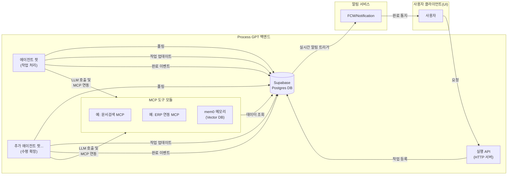
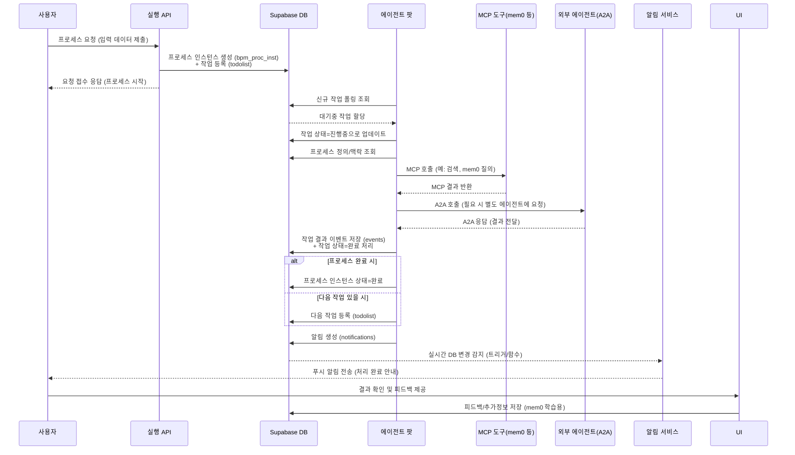

# Process GPT 실전 매뉴얼

## 1. 전체 아키텍처 개요

Process GPT의 시스템은 멀티 에이전트 기반 BPM(비즈니스 프로세스 관리) 구조로, 주요 구성 요소로 **실행 API(Execution API)**, **에이전트 팟(Agent Pods)**, **Supabase DB**, **MCP(Model Context Protocol)** 도구, 그리고 **mem0 메모리 시스템** 등을 포함합니다. 실행 API는 사용자로부터 프로세스 요청을 받아들이고, 프로세스 인스턴스를 생성하거나 작업을 등록하는 역할을 합니다. 에이전트 팟은 작업 큐를 폴링(polling)하여 할당된 작업을 처리하는 **워커 프로세스**로, 필요에 따라 확장하여 병렬 처리를 수행합니다. 모든 상태와 데이터는 **Supabase**의 PostgreSQL 데이터베이스에 저장되며, 이는 `todolist`, `bpm_proc_inst` 등의 테이블로 구성된 **프로세스 저장소** 역할을 합니다. 또한 에이전트들은 MCP로 등록된 외부 도구(예: 웹 검색, 사내 지식베이스)와 연계하고, mem0를 통해 **대화 메모리**나 사용자별 맥락 정보를 조회합니다. 아래 그림은 이러한 구성 요소들의 관계를 나타낸 시스템 구조도입니다.



위 **Mermaid** 다이어그램에서 사용자 요청이 Execution API를 거쳐 DB에 저장되고, 여러 에이전트 팟이 이를 가져와 처리하며, 처리 과정에서 MCP 도구와 mem0 메모리를 활용하고, 최종 결과는 DB 및 알림을 통해 사용자에게 전달되는 전체 흐름을 보여줍니다.

## 2. 프로세스 실행 흐름

Process GPT에서 하나의 프로세스 실행은 **사용자 요청**에서 시작하여 **에이전트 처리**를 거쳐 **결과 반영** 및 **피드백**으로 이어집니다. 이를 단계별로 살펴보면 다음과 같습니다:

1. **사용자 요청 및 프로세스 인스턴스 생성:** 사용자가 웹 UI나 API를 통해 프로세스를 시작하면, Execution API가 해당 요청을 접수합니다. 예를 들어 `/complete` 엔드포인트로 프로세스 정의 ID와 입력 데이터를 전달하면, 시스템은 새로운 프로세스 인스턴스를 생성합니다(`bpm_proc_inst` 테이블에 레코드 추가). 이때 프로세스 정의에 따른 초기 단계가 설정되고, **할 일 작업**이 `todolist` 테이블에 등록됩니다 (예: 처리해야 할 작업 항목으로서).
2. **작업 큐 등록:** 생성된 프로세스 인스턴스에 대한 첫 번째 작업(예: 사용자의 답변을 처리하거나 다음 단계 수행)이 `todolist`에 추가되면, 해당 레코드는 *대기* 상태로 큐에 쌓입니다. `todolist` 테이블에는 작업 ID, 관련 프로세스 인스턴스 ID, 작업 타입/내용, 상태(대기/진행/완료), 우선순위 등이 기록됩니다. 동시에 프로세스 인스턴스의 상태(`bpm_proc_inst.status`)는 *진행 중*으로 표시됩니다.
3. **에이전트 팟의 작업 폴링:** 하나 이상의 에이전트 팟 프로세스가 지속적으로 `todolist`를 폴링하여 자신이 처리할 새로운 작업이 있는지 확인합니다. 폴링 주기는 짧게 유지되어 실시간 처리에 가깝게 동작하며, 각 팟은 서로 경쟁적으로 (또는 락을 통해 상호 배제하여) 새로운 작업을 가져갑니다. 작업을 가져온 에이전트 팟은 해당 작업을 **진행 중**으로 상태 업데이트하여 다른 팟이 같은 작업을 중복 처리하지 않도록 합니다.
4. **프로세스 정의 및 오케스트레이터 결정:** 에이전트 팟은 작업을 처리하기 전에, 어떤 **프로세스 정의**에 속한 작업인지 조회합니다. `bpm_proc_inst`에 연결된 프로세스 정의 ID를 통해 프로세스의 전체 흐름과 규칙을 파악합니다. 이 정보와 작업 종류에 따라, 해당 작업에 사용할 \*\*에이전트 오케스트레이터(agent orchestrator)\*\*가 결정됩니다. 예를 들어 간단한 응답 생성 작업은 `openai-deep-research`가 아닌 `crewai-action`과 같은 간단한 오케스트레이터를 사용할 수 있습니다. 복잡한 리서치 작업이라면 `crewai-deep-research`와 같은 멀티에이전트 오케스트레이터가 선택됩니다.
5. **LLM 및 MCP 처리:** 에이전트는 정해진 오케스트레이터 로직에 따라 LLM 프롬프트를 생성하고 OpenAI 등 **언어 모델**에 질의합니다. 이때 필요에 따라 **MCP 도구** 호출이 이루어집니다. 예를 들어 프롬프트 생성 중 외부 데이터가 필요하면 “검색 MCP”나 “사내문서 MCP”를 호출하여 필요한 정보를 얻습니다. MCP 호출은 주어진 컨텍스트를 기반으로 설정된 API나 함수로 수행되며, 결과를 LLM의 답변과 결합해 후속 처리를 진행합니다. **mem0** 또한 중요한 MCP 구성 요소로, 작업과 관련된 과거 대화나 사용자 성향 정보를 질의하여 가져옵니다. 에이전트 팟은 `mem0`에 질의함으로써 현재 사용자나 프로세스와 연관된 이전 피드백이나 지식을 벡터 검색으로 찾아냅니다.
6. **A2A 에이전트 호출 (필요 시):** 만약 현재 작업이 특정 전문 에이전트의 도움이 필요하면, **Agent-to-Agent** 호출이 이루어집니다. 예를 들어 법률 검토 단계에서는 메인 에이전트가 **법률검토 에이전트**에게 A2A로 질문을 보낼 수 있습니다. 에이전트 간 호출은 사전에 정의된 프로토콜에 따라 HTTP API를 호출하거나, 공용 DB 큐에 메시지를 남기는 방식으로 수행됩니다. `a2a_agent_client.py` 모듈이 이러한 통신을 담당하며, 대상 에이전트의 endpoint와 payload를 전달하면, **상호 협력 에이전트**가 해당 요청을 받아 처리한 후 응답을 돌려줍니다.
7. **작업 완료 및 결과 저장:** 에이전트 팟은 LLM 응답과 MCP/A2A 결과를 종합하여 해당 작업을 완료합니다. 작업 완료 시 `todolist`의 상태를 *완료*로 업데이트하고, 산출된 결과나 다음 단계 정보를 **이벤트(`events`) 테이블**에 기록합니다. `events` 테이블에는 프로세스 진행 중 발생한 주요 이벤트(예: 특정 단계 완료, 의사결정 결과, 생성된 텍스트 등)가 타임라인 순으로 저장되어 프로세스 실행 로그를 구성합니다. 필요한 경우 결과물(예: 생성된 문서나 요약본)은 `documents` 테이블에 저장되고, events에는 그 참조만 기록하기도 합니다.
8. **프로세스 인스턴스 상태 업데이트:** 하나의 프로세스에 여러 작업이 연속될 경우(예: 다단계 승인 프로세스), 에이전트 팟은 다음 할 일을 `todolist`에 추가하고 프로세스 인스턴스(`bpm_proc_inst`)의 상태를 계속 *진행 중*으로 둡니다. 반면 해당 프로세스가 최종 완료되는 경우, `bpm_proc_inst`의 상태를 *완료*로 변경합니다. 이로써 특정 프로세스 실행이 끝났음을 시스템이 인지하게 됩니다.
9. **알림 발송 및 사용자 피드백:** 작업 완료나 프로세스 종료 시, 사용자에게 결과가 전달됩니다. API 호출의 경우 즉시 결과(JSON 형태)가 반환되거나, 프론트엔드가 DB의 events/documents 내용을 실시간으로 구독하여 표시합니다. 또한 별도의 **알림 서비스**가 동작하여, `notifications` 테이블에 새로운 알림이 생성되면 FCM(Firebase Cloud Messaging) 등을 통해 사용자 디바이스나 이메일로 푸시 알림을 보냅니다. 운영자는 Supabase의 트리거 기능이나 FCM 서비스(`fcm_service`)를 활용해 특정 이벤트 발생 시 자동으로 `notifications` 레코드를 생성하고 발송까지 이루어지도록 설정할 수 있습니다. 마지막으로 사용자가 결과를 확인하고 피드백을 제공하면, 그 내용이 mem0 등에 저장되어 추후 유사 작업의 품질 향상에 활용됩니다.

위 흐름을 요약하면, **사용자 요청 -> 프로세스/작업 등록 -> 에이전트 처리 -> 결과 저장 -> 알림/피드백**의 사이클로 이루어집니다. 아래 시퀀스 다이어그램은 이 단계를 순차적으로 보여줍니다:



이와 같이 **todolist**, **bpm\_proc\_inst**, **events**, **notifications** 테이블이 각 단계를 매개하며, 에이전트는 MCP/A2A를 통해 필요한 작업을 수행하고 결과를 남깁니다. 운영자는 이러한 흐름을 통해 시스템 동작을 이해하고 문제 발생 시 어느 단계에서 이슈가 있는지 파악할 수 있습니다.

## 3. MCP (Model Context Protocol)

\*\*MCP(Model Context Protocol)\*\*는 에이전트에게 외부 도구나 맥락 정보를 제공하기 위한 프로토콜이자 인터페이스입니다. 쉽게 말해 LLM 에이전트에 \*\*“툴 사용 능력”\*\*을 부여하는 방식으로, 프롬프트나 API 호출을 통해 외부 시스템과 연계합니다. MCP는 예를 들어 다음과 같은 기능을 수행합니다:

* **외부 API 도구 호출:** 에이전트가 내부적으로 해결하기 어려운 작업이나 데이터 조회가 필요할 때, 미리 등록된 MCP로 해당 기능을 호출합니다. 예를 들어 *Perplexity MCP*는 웹 검색 질의를 처리하고 결과를 반환하거나, *PowerPoint MCP*는 프레젠테이션 작성을 도와줄 수 있습니다.
* **사내 시스템 연동:** 사내 데이터베이스나 ERP와 연계된 MCP를 통해 에이전트가 기업 내부 정보에 접근합니다. 예를 들어 *ERP MCP*를 통해 재고/회계 정보를 조회하거나 업데이트할 수 있고, *사내문서 접근 MCP*로 사내 지식 문서를 검색할 수 있습니다.
* **컨텍스트 확장:** 에이전트의 기본 프롬프트에 동적으로 맥락을 추가합니다. 예를 들어 mem0 MCP를 호출하면 해당 사용자나 업무와 관련된 과거 사례, 선호도 등의 맥락 데이터를 벡터 검색으로 찾아 반환하고, 에이전트는 이를 참고하여 더 정확한 답변을 생성합니다.

MCP 도구들은 **설정 파일** 또는 **DB 설정**을 통해 등록/관리됩니다. Process GPT에서는 `mcp.json` 또는 Supabase DB의 MCP 구성 테이블을 통해 MCP 목록을 정의하며, 각 MCP에는 **이름**, **설명**, **호출 방법(API Endpoint 등)**, **입출력 포맷** 등이 명시됩니다. 운영자는 새로운 MCP를 추가할 때 이러한 설정에 신규 도구를 등록하고, 해당 도구의 API 키나 접속 정보 등을 환경 변수에 추가해야 합니다. 또한 MCP 설정은 `mcp_config_api.py`를 통해 동적으로 관리될 수 있어, 실행 중에도 MCP를 Enable/Disable하거나 파라미터를 조정할 수 있습니다.

에이전트가 MCP를 호출하는 방식은 **프롬프트 설계**와 **후처리 로직** 두 부분으로 이뤄집니다. 프롬프트 단계에서 에이전트는 도구 사용 의도를 나타내는 특별한 출력이나 함수를 생성하며, 오케스트레이터는 이를 감지하여 실제 MCP API 호출을 수행합니다. 예를 들어 에이전트의 출력에 `"CALL_MCP:search('키워드')"`와 같은 형태가 나타나면, orchestrator는 search MCP의 API를 호출하고 그 결과를 다시 프롬프트에 반영합니다. OpenAI 함수 호출 기능을 사용할 수도 있으며, MCP를 함수로 등록해 모델이 함수 호출 형태로 응답하도록 유도할 수도 있습니다. 이렇게 함으로써 에이전트는 자신의 한계를 넘어서는 도구 활용 능력을 얻게 됩니다.

**MCP 등록/관리 요약:**

* 새로운 MCP 추가: `mcp.json`에 도구명, 설명, API 경로, 파라미터 정보 추가 **또는** Supabase DB에 MCP 레코드 Insert.
* 관련 환경변수 설정: API 키, URL 등 (.env에 추가).
* 에이전트 프롬프트 템플릿에 해당 MCP 사용 예시 또는 함수 콜 힌트 추가 (모델이 필요시 호출하도록).
* `agent_executor` 또는 orchestrator 코드에 MCP 호출 처리 로직 존재 확인/구현 (모델 출력 파싱 -> 실제 호출 -> 결과 수집).
* 운영 중 모니터링: MCP 호출 빈도와 응답 시간을 모니터링하여 성능 이슈 없는지 확인.

이러한 MCP 구조를 통해 Process GPT는 **도메인 특화 도구들과 연계된 지능형 프로세스**를 구현할 수 있습니다. 예컨대 영업 프로세스에서는 CRM 데이터 MCP, 제조 프로세스에서는 MRP/품질관리 MCP 등을 추가하여 맞춤형 에이전트를 구축할 수 있습니다.

## 4. A2A 호출 방식

**A2A(Agent-to-Agent)** 호출은 하나의 에이전트가 다른 에이전트에게 도움을 요청하거나 작업을 위임하는 메커니즘입니다. 일반적으로 다음과 같은 **트리거 조건**과 **구조**로 동작합니다:

* **트리거 조건:** 에이전트가 자신 외에 별도의 전문 에이전트의 기능이 필요하다고 판단할 때 A2A를 트리거합니다. 이 판단은 프로세스 정의에 명시적으로 규정되거나, 에이전트 오케스트레이터의 논리에 따라 이루어집니다. 예를 들어 프로세스 중 "법률 검토" 단계가 있으면 해당 작업은 자동으로 *법률 에이전트*에 A2A 요청을 보내도록 정의할 수 있습니다. 또는 에이전트 답변 생성 중 특정 키워드(예: "언어 번역")가 나오면 번역 에이전트에 위임하도록 코딩할 수도 있습니다.
* **구조:** A2A 호출은 메시지 전달 방식으로 구현됩니다. 호출 에이전트는 대상 에이전트에게 \*\*질의(payload)\*\*를 보내고, 대상 에이전트는 이를 처리한 뒤 **응답**을 반환합니다. 이때 양측 에이전트는 **공통 프로토콜**로 통신해야 하는데, 일반적으로 HTTP API 형태나 DB 기반 큐로 상호작용합니다. Process GPT에서는 각 에이전트 팟이 HTTP 서버(`agent_server.py`)를 통해 동료 에이전트의 요청을 받을 수 있습니다. `a2a_agent_client.py`는 타 에이전트에게 REST API 호출을 보내는 클라이언트로, 대상 에이전트의 엔드포인트 URL과 필요한 파라미터를 구성하여 요청을 전송합니다.
* **메시지 전달 방식:** A2A 메시지는 보통 JSON 형식으로, 호출 목적(어떤 작업/질문인지), 컨텍스트(현재까지의 정보), 필요 응답 형태 등을 포함합니다. 예컨대 법률 검토 요청 시에는 `{"action":"legal_review", "content": "...내용...", "deadline": "..."} `와 같은 payload를 법률 에이전트에 POST로 보낼 수 있습니다. 대상 에이전트는 이를 받아 자신의 LLM이나 로직으로 처리한 후 `{"result": "...", "confidence": 0.95}` 등의 응답을 돌려줍니다.
* **연동 예시:** **예1)** 메인 에이전트가 고객 이메일 답변을 작성하다가, 내용 중 계약 조항 해석이 필요하여 법률 에이전트에 A2A 호출. 법률 에이전트는 계약 조항을 검토하고 해석 결과를 반환, 메인 에이전트는 이를 답변에 반영합니다. **예2)** 생산 관리 에이전트가 제조 일정을 수립하다가, 재고 정보가 필요하면 재고 관리 에이전트에 A2A 호출. 재고 에이전트는 현재 재고 데이터를 조회하여 제공, 이를 바탕으로 생산 일정이 조정됩니다.
* **동기/비동기 처리:** A2A 호출은 동기적으로 구현될 수도 있고, 비동기로 구현될 수도 있습니다. 동기 방식에서는 호출한 에이전트가 응답을 기다려 받은 뒤 처리 계속하며, 비동기 방식에서는 호출 즉시 다음 일을 진행하거나 폴링으로 나중에 결과를 확인합니다. Process GPT의 A2A는 주로 **동기 호출** 형태로 구현되어, 하나의 에이전트 작업 흐름 내에서 다른 에이전트의 결과를 즉시 활용하는 패턴이 많습니다.

요약하면, A2A는 **에이전트 간에 전문가 지식을 공유**하여 복잡한 업무를 **협업적으로 처리**할 수 있게 해줍니다. 이를 통해 단일 LLM의 한계를 넘어서 여러 특화된 지능을 조합한 결과를 얻을 수 있으며, 실제 사례로 OpenAI의 기능 호출 예제나 Google의 에이전트 협력 SDK 등이 이러한 개념을 활용하고 있습니다.

## 5. mem0 기반 학습 구조

Process GPT에서는 **mem0**를 활용하여 에이전트의 학습과 경험이 축적되고 재사용되는 **자기강화 학습 구조**를 갖추고 있습니다. mem0는 대화나 업무 수행 과정에서 얻은 지식을 벡터 형태로 저장하고 필요한 시점에 불러오는 **메모리 모듈**입니다. 이를 통해 에이전트는 시간이 지남에 따라 더 똑똑해지고 사용자 맥락에 최적화됩니다.

### 피드백 수집 및 저장

에이전트가 작업을 수행한 후에는 그 결과에 대한 평가나 피드백이 수집됩니다. 피드백은 명시적으로 사용자가 제공할 수도 있고(예: "이 답변은 부정확합니다"와 같은 평가), 암묵적으로 시스템이 판단할 수도 있습니다(예: 잘못된 답으로 인해 이어진 예외 상황 등). 이러한 **피드백 데이터**는 mem0에 저장되어 이후 학습에 활용됩니다. mem0는 PostgreSQL의 pgvector 등의 벡터 DB를 기반으로 구현되어, 텍스트 피드백이나 문서를 임베딩 벡터로 변환하여 저장합니다. 예를 들어 사용자가 교정한 정답 문장이 있다면 해당 원본 답변과 올바른 답변을 함께 메모리에 저장해둡니다.

### 메모리 재사용 (재학습)

새로운 작업을 수행할 때 에이전트는 mem0를 질의하여 **과거의 유사한 맥락**을 찾아냅니다. 벡터 유사도 검색을 통해 현재 질문/작업과 관련 높은 이전 대화, 문서, 피드백을 가져오며, 이를 프롬프트에 추가함으로써 과거 학습 내용을 재사용합니다. 이 방식은 인간이 과거 경험을 떠올려 문제를 푸는 것과 비슷하며, LLM의 맥락창을 효과적으로 확장하는 역할을 합니다. 결과적으로 에이전트의 성능은 시간이 흐를수록 축적되는 mem0 데이터로 향상되고, 동일한 실수를 반복하지 않게 될 확률이 높아집니다.

### Agent Boss 역할 (인간 피드백)

**Agent Boss**는 시스템 운영자 또는 도메인 전문가로서, 에이전트의 학습을 도와주는 **인간 트레이너** 역할을 수행합니다. Agent Boss는 멀티 에이전트 조직에서 상위 관리자로 비유될 수 있는데, 주된 임무는 다음과 같습니다:

* 에이전트의 **페르소나와 지식 주입:** Agent Boss는 각 에이전트에게 필요한 페르소나(역할)와 스킬을 정의하고, 자연어로 지식을 가르칩니다. 예를 들어 신규 영업 에이전트에게 회사 제품 목록과 특징을 설명해주는 식입니다. 이러한 지식은 mem0나 별도의 **지식 그래프**(예: Neo4j)에 저장되어 에이전트가 활용할 수 있게 됩니다.
* **피드백 검수 및 보강:** 에이전트의 응답 중 잘못된 부분이 있으면 Agent Boss가 이를 교정하여 올바른 정보를 mem0에 기록해 줍니다. 또한 에이전트가 놓친 중요한 맥락이나 개선점이 있으면 추가 설명을 해주어 다음번엔 개선되도록 합니다. 이 과정은 사람의 RLHF(Reinforcement Learning from Human Feedback)와 유사하며, mem0를 통해 지속적으로 지식이 보완됩니다.
* **업무 감독:** Agent Boss는 여러 에이전트들의 활동 로그(events 등)를 모니터링하고, 필요시介入(介入)하여 프로세스의 병목이나 오류를 해결합니다. 이는 프로세스 정의를 개선하거나 오케스트레이션 전략을 조정하는 형태로 이루어집니다.

이러한 mem0 기반 학습 구조 덕분에 Process GPT는 단발성 답변에 그치지 않고 **경험을 축적**하여 시간이 지날수록 업무 품질과 효율이 향상되는 자기학습 조직을 구현합니다. 특히, 사람인 Agent Boss의 지도가 결합되면서 **인적 지식**과 **AI 능력**이 융합된 형태의 운영이 가능해집니다.

## 6. 에이전트 오케스트레이터 구조

Process GPT의 에이전트는 단순히 한 번의 프롬프트-응답으로 동작하지 않고, **오케스트레이터**라 불리는 제어 로직에 따라 복잡한 작업을 수행합니다. 오케스트레이터는 에이전트의 **행동 시나리오**를 정의한 것으로, 다양한 종류가 있으며 각기 다른 방식으로 에이전트를 움직입니다:

* **crewai-action 오케스트레이터:** 오픈소스 CrewAI 프레임워크를 활용한 오케스트레이터로, 비교적 **단일 에이전트 액션**에 초점을 맞춥니다. 하나의 에이전트가 주어진 목표를 바로 달성하는 간명한 플로우를 갖으며, 불필요한 중간 단계 없이 곧바로 답을 찾도록 설계됩니다. 예를 들어 간단한 질의 응답, 단순 계산 등의 프로세스에 적합하며, CrewAI의 경량화된 구조로 신속히 Action을 수행합니다.
* **crewai-deep-research 오케스트레이터:** CrewAI를 기반으로 하지만 여러 역할의 에이전트를 활용해 **깊이있는 조사**를 수행하는 오케스트레이터입니다. 이 방식에서는 하나의 질문에 대해 탐색자, 분석가, 비평가, 작성자 등 \*\*여러 하위 에이전트(crew)\*\*를 구성하여 협력하게 합니다. 예컨대 리서치 과제라면, 검색 전문 에이전트가 자료를 찾고, 요약 에이전트가 내용을 정리하며, 최종 작성 에이전트가 결과를 산출하는 식입니다. crewai-deep-research 오케스트레이터는 이러한 순차/병렬 협업 흐름을 관리하여, 보다 정확하고 풍부한 답을 얻습니다.
* **openai-deep-research 오케스트레이터:** OpenAI에서 발표한 AutoGPT/DeepResearch와 유사한 컨셉의 오케스트레이터로, **자율적인 계획 및 탐색**을 특징으로 합니다. 이 오케스트레이터에서는 에이전트가 스스로 목표를 세분화하고, 단계별로 가설을 세워 검증하면서 목표에 접근합니다. 예를 들어 "제품 시장 조사를 하라"는 목표를 받으면, 자체적으로 "1) 경쟁사 목록 수집 -> 2) 각 경쟁사 분석 -> 3) 요약 정리" 등의 플랜을 세우고 실행합니다. 필요 시 자신에게 추가 프롬프트를 던지거나, 비판적 검토를 거쳐 답을 개선하는 루프를 가질 수도 있습니다.
* **browser-use 오케스트레이터:** 에이전트가 **브라우저 도구**를 사용하여 정보를 수집하고 처리하는 흐름에 특화된 오케스트레이터입니다. 예를 들어 사용자의 질문이 최신 뉴스에 대한 것이라면, browser-use 오케스트레이터는 에이전트에게 검색 엔진 MCP를 사용해 웹에서 정보를 찾게 하고, BrowserBox 등 임베디드 브라우저를 통해 페이지를 읽어오도록 지시합니다. 그 후 수집된 정보를 요약/가공하여 사용자에게 제공하는데, 이러한 일련의 동작 (검색 -> 스크랩 -> 요약)이 미리 정의된 시나리오로 구현되어 있습니다. 즉, **도구 활용형 시나리오**를 전문으로 하는 오케스트레이터라 할 수 있습니다.

### 새로운 오케스트레이터 추가 방법

시스템을 확장하거나 새로운 유형의 작업에 대응하기 위해 **사용자 정의 오케스트레이터**를 추가할 수 있습니다. 새로운 오케스트레이터를 추가하는 절차는 다음과 같습니다:

1. **agent\_orch 등록:** Supabase DB나 설정 파일에 새로운 오케스트레이터를 식별할 ID/이름으로 등록합니다. 예를 들어 `agent_orch` 테이블(가정)이나 JSON 설정에 `{ "id": "custom_orch", "name": "맞춤 오케스트레이터", "description": "...", ... }` 형태로 기록해 둡니다. 이렇게 해야 프로세스 정의에서 해당 오케스트레이터를 지정할 수 있고, 시스템 초기화 시 로딩됩니다.
2. **처리 로직 구현:** 백엔드 코드에서 새로운 오케스트레이터의 \*\*폴러(poller)\*\*와 \*\*러너(runner)\*\*를 구현합니다. Poller는 작업 큐에서 특정 조건(예: 특정 프로세스 정의 혹은 작업 타입)에 해당하는 작업을 선별하여 가져오는 역할을 합니다. 기본 polling\_service를 확장하거나 새로운 스케쥴러를 작성할 수 있습니다. Runner는 가져온 작업을 실제로 처리하는 함수/클래스로, 오케스트레이터의 핵심 로직을 담습니다. 여기서 해당 오케스트레이터만의 시나리오에 따라 LLM 호출, MCP/A2A 사용, 멀티에이전트 분기 등을 코딩합니다. 필요하면 기존 `agent_executor` 흐름을 참고하여, 작업 시작/완료 시점에 DB를 업데이트하고 이벤트를 기록하는 부분도 구현합니다.
3. **프롬프트 템플릿 및 MCP 연동:** 오케스트레이터에 특화된 프롬프트 템플릿을 설계합니다. 예를 들어 여러 단계 계획이 필요한 경우 첫 프롬프트에 "목표를 세분화하고 단계별로 계획을 수립하라"는 지침을 넣을 수 있습니다. 또한 해당 오케스트레이터가 활용할 MCP나 도구가 있다면, 프롬프트에 그 사용법 예시를 포함하거나, 모델의 출력 형식을 약속해두어 파싱 및 MCP 호출이 원활하도록 합니다. **예:** custom\_orch가 특정 API를 항상 호출해야 한다면, 출력에 `<API_CALL>` 태그를 붙이도록 설계하고 코드에서 이를 탐지해 API를 호출한 뒤 응답을 합성하는 방식입니다.
4. **테스트 및 튜닝:** 새로운 오케스트레이터를 추가한 후에는 다양한 시나리오로 테스트하며, 의도한 대로 멀티에이전트 상호작용 또는 도구 호출이 이뤄지는지 검증합니다. 특히 멀티에이전트 협업이 있는 경우 deadlock 없이 완료되는지, 또한 결과 품질이 원하는 수준인지 확인해야 합니다. 필요하면 프롬프트를 수정하고, 에이전트 역할 설명을 보강하거나, 불필요한 반복이 발생하면 이를 제한하는 로직도 추가합니다.

정리하면, 오케스트레이터는 **에이전트의 두뇌**에 해당하는 부분으로서, 다양한 업무 종류에 맞게 커스터마이징 가능합니다. crewAI와 같이 공개된 멀티에이전트 프레임워크를 활용하거나, OpenAI 함수호출 등의 최신 기법을 도입하여 새 오케스트레이터를 설계함으로써, Process GPT의 활용 범위를 넓힐 수 있습니다.

## 7. 에이전트 팟 실행 모델

Process GPT의 에이전트 팟(Agent Pod)은 **싱글 쓰레드**로 동작하는 가벼운 서비스이며, 필요에 따라 여러 개의 팟을 배포하여 수평 확장하는 구조를 취합니다. 각 팟은 독립적인 프로세스로서 하나의 작업 폴링 루프를 실행하고, 자체적으로 OpenAI API 호출 등을 수행하지만, **공유 스테이트는 DB**를 통해 관리합니다. 이러한 디자인은 다음과 같은 특징과 이점을 가집니다:

* **단일 쓰레드 처리:** 한 팟 내에서는 한 시점에 하나의 작업만 처리합니다. 파이썬 GIL이나 I/O 대기 등의 이슈 없이 직렬로 작업을 수행하므로, 코드가 단순해지고 동시성 버그가 줄어듭니다. 만약 하나의 작업이 LLM 응답을 기다리는 동안에는 해당 팟은 빈 상태가 되지만, 그 동안 다른 팟들이 병렬로 작업을 처리하고 있으면 전체적으로는 여러 작업이 동시에 진행됩니다.
* **여러 팟으로 수평 확장:** 시스템 부하가 증가하면 에이전트 팟을 2개, 3개… 식으로 늘려서 **병렬 처리량을 높일 수 있습니다**. 모든 팟은 동일한 코드를 실행하며, 공통 DB의 `todolist`를 모니터링하기 때문에 새로운 팟이 추가되면 자연스럽게 작업 소비 속도가 증가합니다. 예를 들어 팟 1개가 분당 5건 처리하던 것을 3개로 늘리면 이론상 분당 15건까지 처리량이 늘어날 수 있습니다 (LLM API 한도나 기타 I/O가 병목이 되지 않는 한).
* **멀티에이전트 병렬 처리:** 한 프로세스 인스턴스 내에서도 논리적으로 동시에 여러 작업이 진행될 수 있습니다. 예를 들어 crewAI 오케스트레이터 하에서 3명의 하위 에이전트가 협업하는 경우, 이들을 하나의 팟에서 순차적으로 흉내내는 대신, 각 역할을 별개 쓰레드나 팟으로 분배할 수도 있습니다. 현재 구조에서는 기본적으로 **한 작업 = 한 팟**으로 매핑되지만, A2A 호출을 활용하면 한 프로세스의 일부 작업을 다른 팟에 넘겨 병렬 실행하는 것도 가능합니다. 다만 이런 고급 병렬화는 설계가 복잡해질 수 있어, 대부분의 기본 시나리오에서는 프로세스의 주요 흐름은 단일 팟에서 순서대로 실행되고 필요시 외부 agent가 간헐적으로 참여하는 형태입니다.
* **pod replica 증설 효과:** 작업 대기열(todolist)이 길어지는 것은 **처리 병목**을 의미합니다. 이때 Kubernetes 등으로 Pod 레플리카 수를 증가시키면, 각 팟이 병렬로 큐를 비우므로 대기 시간이 단축됩니다. 특히 CPU나 네트워크 IO가 여유로운 경우 pod를 늘리는 것은 선형적으로 처리 성능을 높여줍니다. 예를 들어 평균 작업 처리 시간이 10초이고 1분에 60건 요청이 들어오면, 팟 1개로는 처리 적체가 생기지만 팟 2개로 늘리면 각각 30건씩 처리하여 적체를 해소할 수 있습니다. \*\*백프레셔(backpressure)\*\*를 완화하기 위한 1차 조치는 이처럼 **수평 확장**이며, Process GPT의 무상태 아키텍처는 이를 용이하게 지원합니다.
* **리소스 사용 및 격리:** 각 팟은 별개 컨테이너로서, 하나가 오류로 종료되더라도 다른 팟에 영향을 주지 않습니다. 또한 LLM API 키 등의 민감 정보를 각 컨테이너에 주입하여 격리된 환경에서 운영할 수 있습니다. 이러한 격리 덕분에 한 팟에서 메모리 누수가 발생해도 전체 시스템 다운을 막을 수 있고, 문제가 된 팟만 재기동하면 됩니다. 반면 단일 프로세스에서 멀티스레드로 모두 처리할 경우 한 부분의 에러가 전체 프로세스에 영향줄 수 있지만, Process GPT는 다중 팟 구조로 안정성을 높였습니다.

결론적으로, 에이전트 팟 실행 모델은 **단순성, 확장성, 안정성**을 모두 고려한 설계입니다. 운영자는 부하 상황에 따라 팟 수를 동적으로 늘이거나 줄여서 최적의 처리량을 유지할 수 있으며, 이러한 확장은 Kubernetes Deployment의 replicas 설정이나 HPA를 통해 자동화할 수도 있습니다.

## 8. 운영자용 운영 가이드

운영 관점에서, Process GPT 시스템을 안정적으로 운영하기 위해서는 **작업 큐 상태 모니터링**, **오류/재시도 관리**, **백프레셔 대응**, **자동 확장 튜닝** 등에 유의해야 합니다. 아래에 주요 운영 지표와 대응법을 정리합니다:

* **작업 큐 처리 상태 모니터링 지표:** 가장 중요한 지표는 `todolist` 테이블의 **대기 중 작업 수**입니다. 이 값이 지속적으로 증가한다면 시스템이 들어오는 요청을 제때 처리하지 못하고 있다는 신호입니다. Supabase 대시보드나 API를 통해 테이블 행 수를 모니터링하거나, 별도 모니터링 도구로 주기적인 COUNT를 수집합니다. 또한 각 작업의 **대기 시간**(시작 시간 - 생성 시간)과 **처리 시간**(완료 시간 - 시작 시간) 분포를 추적하여 SLA 준수 여부를 판단합니다. `bpm_proc_inst`의 상태별 건수(진행중, 대기, 오류 등)도 모니터링 포인트입니다.
* **오류 및 재시도 관리:** 에이전트 처리 중 예외가 발생할 수 있습니다 (예: LLM API 오류, MCP 타임아웃 등). 이런 경우 해당 작업을 **retry**하는 로직이 필요합니다. 운영자는 `events` 테이블에서 오류 이벤트를 확인하고, `todolist`에 재시도 플래그를 세워 동일 작업을 재투입할 수 있습니다. 자동 재시도를 구현하려면, polling 서비스가 실패 감지 시 `todolist`의 재시도 횟수를 증가시키고 일정 횟수 이하일 때 다시 상태를 대기로 전환하도록 합니다. 재시도 간에는 지수 백오프(예: 1분 후, 5분 후 등)를 적용하여 연속 실패로 인한 자원 낭비를 막습니다. 또한 **치명적 오류**(예: 잘못된 프로세스 정의 등)인 경우 반복해봐야 소용없으므로 해당 인스턴스를 **오류 상태**로 마무리하고 운영자에게 알람을 보내도록 설계합니다.
* **큐 누적 및 백프레셔 대처:** 만약 일시적으로 요청량이 급증하여 큐가 쌓이기 시작하면, **백프레셔(backpressure)** 전략을 가동해야 합니다. 첫 번째로, **자동 스케일 아웃**이 설정돼 있다면 추가 팟이 런칭되어 완화됩니다 (아래 참조). 그럼에도 큐가 계속 증가하면, 프런트엔드 또는 API 단에서 신규 요청을 제어할 필요가 있습니다. 예를 들어 임계치 이상의 요청이 들어오면 일시적으로 "지금은 처리 요청이 몰려 지연되고 있습니다"라는 메시지를 주거나, 아예 큐에 넣지 않고 실패 응답을 주어 클라이언트가 재시도하게 유도할 수 있습니다. 또한 **우선순위 큐**를 도입해 긴급한 업무는 먼저 처리하고 덜 중요한 것은 지연시키는 정책도 고려할 수 있습니다.
* **지표 기반 튜닝:** CPU 사용률, 메모리 사용량, LLM API 호출 속도 등의 시스템 지표도 함께 모니터링합니다. CPU가 계속 90% 이상이라면 팟 증설이나 더 높은 스펙 노드 할당을 검토하고, 메모리가 부족하면 OOM이 발생하지 않도록 요청 리밋을 둡니다. LLM API 응답 시간 지연이 누적된다면 모델 엔진 변경이나 프롬프트 최적화도 염두에 둡니다. 이러한 지표들은 Grafana 등 모니터링 툴로 수집/대시보드화하여 한눈에 볼 수 있도록 구성하는 것이 좋습니다.
* **Kubernetes 오토스케일링 적용:** Process GPT를 쿠버네티스에서 운영한다면, \*\*Horizontal Pod Autoscaler (HPA)\*\*를 활용해 자동으로 팟 수를 조절할 수 있습니다. 일반적인 설정 예시는 다음과 같습니다:

  * 메트릭: CPU 사용률 70% 이상이 1분 지속될 경우 스케일 아웃, 20% 이하가 5분 지속될 경우 스케일 인.
  * 또는 커스텀 메트릭: `todolist` 대기 작업 수를 메트릭 서버로 노출시켜, 대기 작업이 10건 이상이면 팟 수 +1 (최대 n까지) 증설하는 정책.
  * 예시 (HPA YAML):

    ```yaml
    apiVersion: autoscaling/v2
    kind: HorizontalPodAutoscaler
    metadata:
      name: process-gpt-agent-hpa
    spec:
      scaleTargetRef:
        apiVersion: apps/v1
        kind: Deployment
        name: process-gpt-agent
      minReplicas: 1
      maxReplicas: 10
      metrics:
      - type: Resource
        resource:
          name: cpu
          target:
            type: Utilization
            averageUtilization: 60
      - type: Pods
        pods:
          metric:
            name: pending_tasks
          target:
            type: AverageValue
            averageValue: 5
    ```

    위 설정은 CPU 사용률이 60%를 넘거나, 커스텀 메트릭 `pending_tasks`(대기 작업 수 평균치)가 5를 넘으면 팟을 추가하도록 합니다. 실제로 커스텀 메트릭을 사용하려면 Kubernetes Metric Server와 애플리케이션 내 메트릭 exporter 설정이 필요합니다. 간단히는 CPU 기반으로 조절해도 대체로 부하와 큐가 정비례하는 경향이 있으므로 큰 무리는 없습니다.
  * 오토스케일 조건 예시: "작업 대기열 0 유지"를 목표로, 매 분 대기 작업을 체크하여 한계치 이전에 팟을 확장합니다. 또한 팟 증설에 수십 초 시간이 걸릴 수 있으므로, **급격한 스파이크**에 대해서는 미리 여유 팟을 조금 띄워두는 보수적 설정이 안전합니다.
* **그 외 운영 팁:**

  * **버전 관리**: 프로세스 정의나 MCP 설정이 바뀔 때는 가급적 새로운 버전을 만들어 기존 인스턴스에는 영향을 주지 않도록 합니다. DB 스키마 변경 시도 마찬가지로 마이그레이션 전략을 세워 downtime 없이 적용합니다.
  * **로그 모니터링**: 에이전트 LLM 응답 로그, 오류 스택 트레이스 등을 수집해두면 문제 발생시 원인 파악이 빠릅니다. Supabase의 함수/트리거 로그, 클라우드 로그도 참고하십시오.
  * **시나리오 테스트**: 정기적으로 중요한 프로세스 시나리오를 샘플 데이터로 실행해보는 자동 테스트를 구축하면, 갑작스런 오류를 조기에 발견할 수 있습니다. 예를 들어 GitHub Actions로 매일 특정 프로세스 API 호출 테스트를 수행하도록 할 수 있습니다.

요약하면, 운영자는 **모니터링 -> 확장/조절 -> 문제해결**의 사이클로 시스템을 관리해야 합니다. 특히 작업 큐의 상태를 상시 주시하면서 선제 조치를 취하는 것이 원활한 서비스 제공의 핵심입니다.

## 9. 주요 테이블/구조 요약 (init.sql 기반)

마지막으로, Process GPT 시스템에서 사용되는 **주요 데이터베이스 테이블**과 구조를 정리합니다. Supabase의 초기 스키마(init.sql)에 정의된 테이블들 중 핵심적인 것들을 살펴보겠습니다:

* **`bpm_proc_inst` (프로세스 인스턴스 테이블)**: 프로세스 실행(instance)의 메타데이터를 저장합니다. 컬럼 예시: `id` (고유 식별자, UUID), `process_definition_id` (프로세스 정의명 또는 ID), `initiator` (시작자, 이메일 등), `status` (상태: e.g. NEW, RUNNING, COMPLETED, ERROR), `start_time`, `end_time` 등. 이 테이블을 통해 현재 진행 중인 프로세스와 그 상태를 한눈에 파악할 수 있습니다. 한 프로세스 인스턴스는 다수의 작업 및 이벤트와 연결되며, `id`를 키로 다른 테이블과 조인합니다.
* **`todolist` (작업 할당 테이블)**: 에이전트가 수행해야 할 개별 작업(Workitem)을 나타냅니다. 컬럼 예시: `task_id` (PK), `proc_inst_id` (연결된 프로세스 인스턴스 ID, FK), `task_type` 또는 `name` (작업 종류/이름), `assignee` (담당 에이전트 아이디 혹은 유형), `status` (PENDING, IN\_PROGRESS, DONE 등), `created_at`, `started_at`, `finished_at`, `priority` (우선순위) 등. 이 테이블은 큐 역할을 하며, polling 서비스는 여기서 status가 PENDING인 레코드를 찾아 처리합니다. 작업 완료 시 status를 DONE으로 업데이트하고 종료 시간을 기록합니다. 재시도 횟수나 오류 메시지 컬럼이 있을 수도 있습니다.
* **`events` (이벤트 로그 테이블)**: 프로세스 진행 중 발생하는 이벤트를 시계열로 기록합니다. 컬럼 예시: `event_id` (PK), `proc_inst_id` (FK), `task_id` (어떤 작업과 연관된 이벤트인지, 없을 수도 있음), `event_type` (이벤트 종류: e.g. TASK\_COMPLETED, USER\_FEEDBACK, ERROR 등), `message` (상세 내용, JSON 또는 텍스트), `timestamp`. 이 테이블은 프로세스의 **활동 이력**을 모두 남겨두므로 추후 감사(audit)나 디버깅에 활용됩니다. 예를 들어 에이전트가 MCP 호출한 내용이나 A2A 요청/응답도 이벤트로 남길 수 있고, 사용자로부터 받은 입력도 이벤트로 저장됩니다.
* **`notifications` (알림 테이블)**: 사용자 알림을 관리합니다. 컬럼 예시: `notify_id`, `user_id` (수신자, 이메일 등으로 식별), `proc_inst_id` (관련 프로세스), `type` (알림 유형: e.g. PROCESS\_DONE, TASK\_ASSIGNED 등), `message` (알림 내용 요약), `read_flag` (읽음 여부), `created_at`. 이 테이블에 Insert되는 시점에 DB 트리거로 외부 Notification 서비스가 호출되거나 Supabase Realtime을 통해 프론트엔드에 전파됩니다. 운영자는 이 테이블을 조회하여 사용자가 어떤 알림을 받았는지, 읽지 않은 알림은 얼마인지 파악할 수 있습니다.
* **`documents` (문서/지식 테이블)**: 프로세스와 연관된 문서나 데이터 조각을 저장합니다. 컬럼 예시: `doc_id`, `proc_inst_id` (어떤 프로세스/케이스와 관련된 문서인지), `title`, `content` (주요 내용, 텍스트 또는 파일 경로), `vector` (벡터 임베딩, pgvector 타입) 등. 이 테이블은 사내 문서나 이전 사례들을 저장해두고 **검색**에 사용하거나, 에이전트가 생성한 요약/보고서 등을 보관하는 용도입니다. 특히 `vector` 칼럼이 존재한다면 mem0와 통합되어 유사도 검색을 제공하며, 특정 질문에 대해 이 테이블에서 적절한 컨텍스트를 찾아 제공하는 역할을 합니다.
* **mem0 관련 구조**: mem0 자체가 별도 서비스이긴 하지만, 통합된 환경에서는 DB에 메모리 저장용 테이블이 존재할 수 있습니다. 일반적으로 `mem0_embeddings` 혹은 `memory`와 같은 테이블이 만들어지며, 여기에 모든 대화 및 피드백 텍스트의 임베딩이 저장됩니다. 예시 컬럼: `id`, `owner_type`/`owner_id` (메모리 단위 구분 – 예: 특정 에이전트/사용자/프로세스 등), `content` (저장된 텍스트), `embedding` (벡터), `created_at`. 이 테이블은 mem0 라이브러리가 자동으로 생성/관리하거나, 개발자가 `documents` 테이블을 재사용하도록 설정할 수도 있습니다. 핵심은 **텍스트 -> 벡터** 변환 데이터가 어딘가 저장돼 있고, 이에 인덱스가 걸려있어 빠른 유사도 검색이 가능하다는 점입니다. Supabase의 pgvector 익스텐션을 통해 이러한 벡터 칼럼에 인덱스를 만들고 유사도 질의를 실행합니다.

以上 구조 이외에도, 사용자 계정/권한 관리를 위한 `auth.users` (Supabase 기본 제공), 프로세스 정의 자체를 저장하는 테이블(예: `process_def`에 JSON 형태로 BPMN이나 프롬프트 템플릿을 저장), 에이전트 설정을 위한 `agent_profile` 등 부가적인 테이블이 있을 수 있습니다. 그러나 핵심은 **프로세스 인스턴스**, **작업**, **이벤트**, **문서/메모리**를 다루는 위 테이블들이며, 개발자와 운영자는 이들의 스키마를 잘 이해하고 활용해야 합니다. 특히 새로운 기능을 추가할 때 이 스키마를 확장(예: 새로운 이벤트 타입 추가, documents에 컬럼 추가 등)하게 되므로, 변경 시에는 마이그레이션 스크립트를 작성하고 서비스 중단 없이 배포하도록 주의해야 합니다.


