# Process-GPT Architecture and Design

## Deployment Architecture

Process-GPT is an **agent-based BPM platform** composed of multiple microservices, each deployed as a Kubernetes pod. The system runs on Kubernetes (e.g., a local Kind cluster) and integrates with external services (OpenAI, search APIs, etc.) as needed. Key components include: 

- **API Gateway** (Java Spring Boot): The entry point for clients, exposing a unified REST API and routing requests to backend services.
- **Execution Engine** (Python FastAPI): Orchestrates business process flows (BPMN/JSON), managing process definitions and instances. It delegates AI-driven tasks to agent services and interacts with the database for persistence.
- **CrewAI Action Agent** (Python): A multi-agent system for task execution, coordinating multiple AI agents (a “crew”) to complete complex tasks.
- **CrewAI Deep Research Agent** (Python): A multi-agent research assistant that divides research queries among multiple agents (searchers, analyzers, aggregators).
- **OpenAI Deep Research Agent** (Python): A single-agent (LLM-based) service that performs research using OpenAI models and tools.
- **React Voice Agent** (Python): A voice-enabled agent that transcribes speech to text (STT), routes intent, and replies via text-to-speech (TTS).
- **Memento Memory Service** (Python): A document memory and retrieval service. It ingests and stores documents and embeddings, allowing agents to retrieve relevant information (vector database functionality).
- **Supabase (Postgres) Database**: A central PostgreSQL database (managed via Supabase) holds persistent data for the platform – process definitions, process instances, tasks, user info, etc.
- **MCP Proxy**: A bridge for safe tool invocation (Model Context Protocol). Agents call tools via this proxy.

Below is a **deployment diagram** illustrating these components and their interactions:

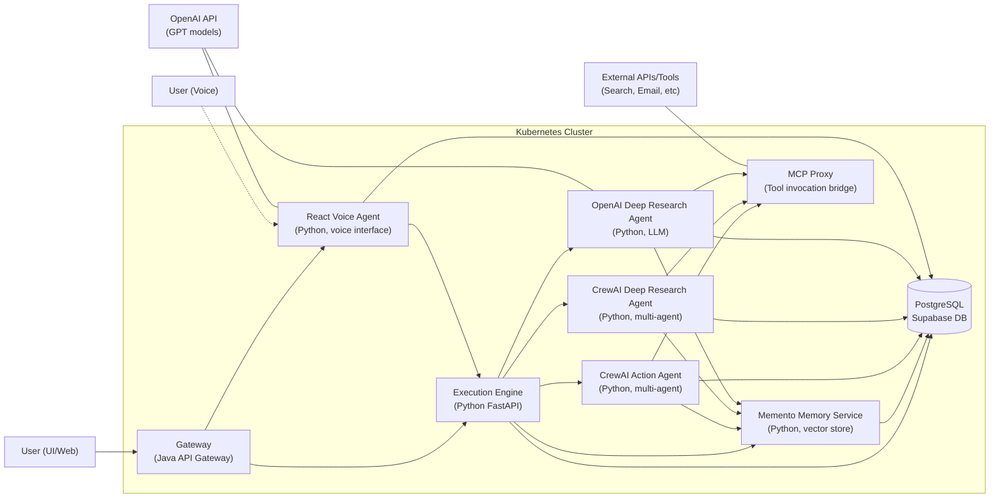

*Figure: Deployment diagram of Process-GPT microservices and external integrations.*

In this architecture, the **Gateway** service is the single point of access for clients (web UI or other applications). It forwards requests to the appropriate backend services. For example, a user action to start or complete a process goes to the Gateway, which then calls the **Execution Engine**. The Execution Engine manages the process logic, interacts with the database, and if an AI-driven task is required, delegates to one of the agent services. 

The **CrewAI Action** and **Deep Research agents** host the logic for autonomous multi-agent collaborations. They use the **MCP Proxy** to perform tool actions (e.g., web browsing, sending emails) in isolation, using configured tool servers. The **OpenAI Deep Research agent** usually involves a single agent (GPT-4 or similar) that may call the OpenAI API or perform its own tool-augmented reasoning for research tasks. 

The **React Voice Agent** connects microphone/speaker input to the system. It will transcribe user speech to text, send it through the Gateway/Execution Engine or directly to an agent, and then synthesize the response back to speech.

All services share a **common database** (Supabase Postgres) for persistence of state. Secrets and configuration (database credentials, API keys for OpenAI, Supabase URL/key, SMTP settings for email, etc.) are managed via Kubernetes secrets and configmaps. A persistent volume can store cached data such as LangChain indexes or other state that should survive pod restarts.

**Networking:** Within the cluster, services communicate over internal cluster networking (each agent has a Kubernetes Service for discovery). The Gateway exposes an HTTP service (port 80) which is port-forwarded for local access. In production, it would be fronted by an ingress or load balancer. 

---

## Database Schema

All persistent data is stored in a **PostgreSQL database** (via Supabase). The core schema includes tables for **Process Definitions**, **Process Instances**, **Work Items**, **Role Mappings**, **Chat Messages**, and **Documents/Knowledge**. The diagram below illustrates the **entity-relationship model** of the main tables (excluding Supabase’s internal auth tables):

```mermaid
erDiagram
    PROCESS_DEFINITION ||--o{ PROCESS_INSTANCE : "defines"
    PROCESS_DEFINITION {
        UUID id PK
        string name
        text bpmn_model  // BPMN XML or JSON definition
        text description
        timestamptz created_at
        varchar created_by  // user id or email
    }
    PROCESS_INSTANCE ||--o{ WORK_ITEM : "has"
    PROCESS_INSTANCE ||--o{ ROLE_MAPPING : "has"
    PROCESS_INSTANCE ||--o{ CHAT_MESSAGE : "has"
    PROCESS_INSTANCE {
        UUID id PK
        UUID process_def_id FK "→ PROCESS_DEFINITION.id"
        varchar status
        timestamptz started_at
        timestamptz completed_at
        varchar initiated_by
    }
    WORK_ITEM {
        UUID id PK
        UUID process_instance_id FK "→ PROCESS_INSTANCE.id"
        varchar task_name
        varchar status
        varchar assigned_to  // user or agent role
        text result
    }
    ROLE_MAPPING {
        UUID id PK
        UUID process_instance_id FK "→ PROCESS_INSTANCE.id"
        varchar role_name
        varchar user_email  // participant fulfilling the role
    }
    CHAT_MESSAGE {
        UUID id PK
        UUID process_instance_id FK "→ PROCESS_INSTANCE.id"
        varchar sender  // e.g., "User" or agent name
        text content
        timestamptz timestamp
    }
    DOCUMENT }o--o{ PROCESS_DEFINITION : "referenced by"
    DOCUMENT {
        UUID id PK
        text title
        text content  // or URL if stored externally
        vector embedding  // pgvector
        timestamptz added_at
        varchar added_by
    }
```

*Figure: Entity-Relationship Diagram of Process-GPT database schema (key tables).* 

**Explanation:**  
- **PROCESS_DEFINITION** stores templates of business processes (BPMN/JSON).  
- **PROCESS_INSTANCE** records runtime executions of processes, linked to a definition.  
- **WORK_ITEM** represents discrete tasks within a process instance (human or AI).  
- **ROLE_MAPPING** binds abstract roles to concrete users/agents per instance.  
- **CHAT_MESSAGE** logs conversational turns linked to a process instance.  
- **DOCUMENT** stores knowledge with vector embeddings for semantic search (used by agents via Memento).  

---

## Execution Engine (Process Execution Service)

The **Execution Engine** interprets and runs business process models. It loads process definitions and handles process instances and their state. It integrates with **AI agents** via HTTP/A2A calls and with the DB for persistence.

**Core Classes and Structure (inferred):**

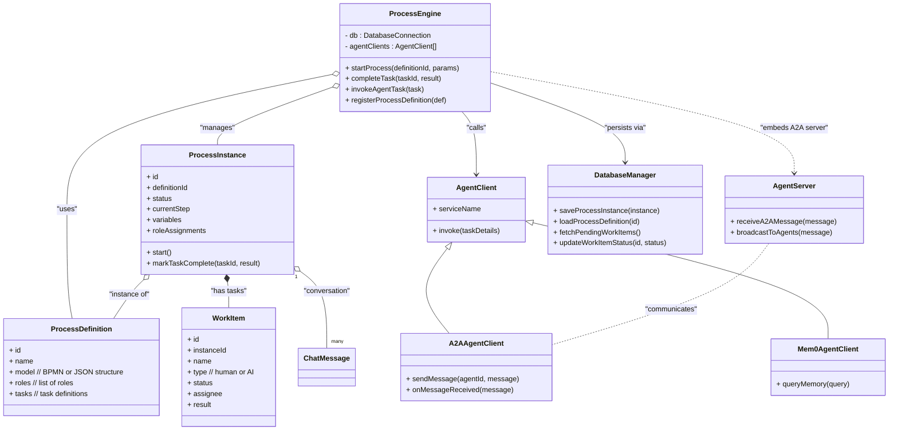

**Typical Sequence (AI task within a process):**

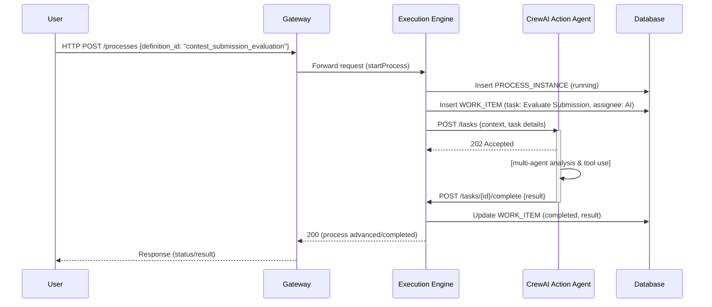

---

## Memento (Document Memory Service)

**Purpose:** Provide long-term memory and knowledge retrieval (RAG) for agents.

**Core Components (inferred):**

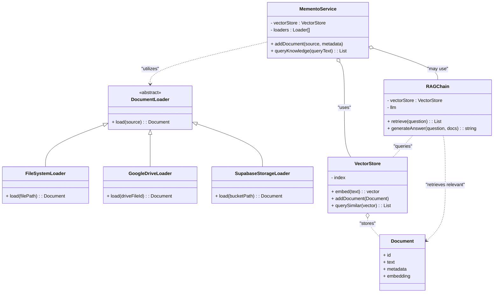

**Query Sequence:**

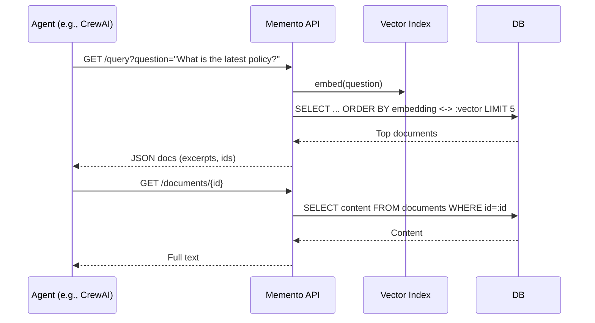

---

## CrewAI Action Agent (Multi-Agent Task Executor)

**Goal:** Manage a crew of role-based AI agents to collaborate on complex tasks (plan → critique → revise → approve).

**Core Structure (inferred):**

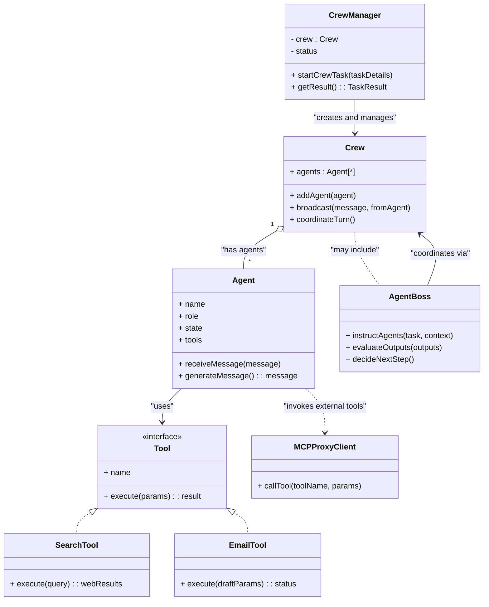

**Collaboration Sequence:**

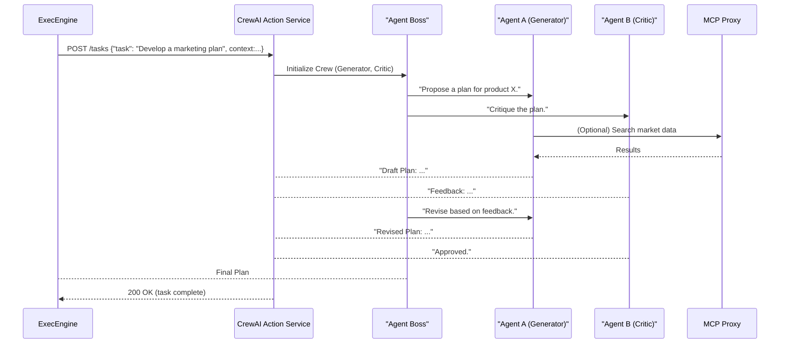

---

## CrewAI Deep Research Agent (Multi-Agent Researcher)

**Goal:** Thorough research using specialized roles (Searcher, Analyst, Lead), combining external sources and internal memory.

**Research Sequence:**

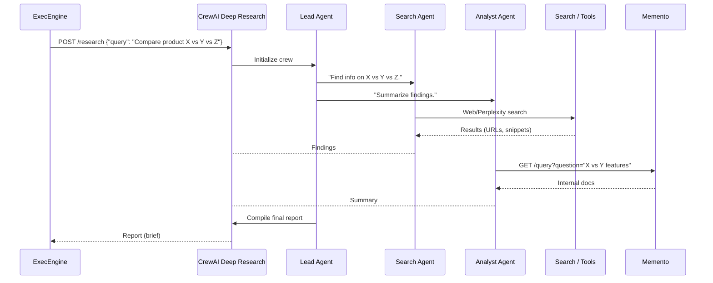

---

## OpenAI Deep Research Agent (Single-Agent Researcher)

**Goal:** Efficient research using a single powerful LLM (e.g., GPT‑4) with tool use (search, memory, calculator).

**Structure (conceptual):**

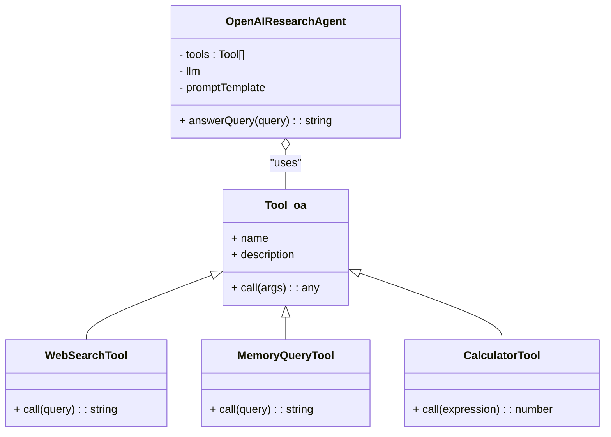

**Query Sequence:**

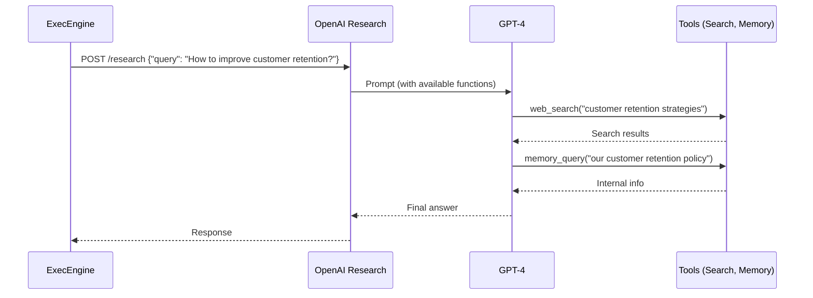

---

## React Voice Agent (Voice Interaction Service)

**Goal:** Provide voice UX with STT, intent routing, and TTS.

**Structure (conceptual):**

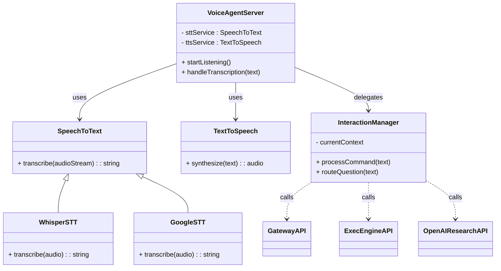

**Voice Command Sequence:**

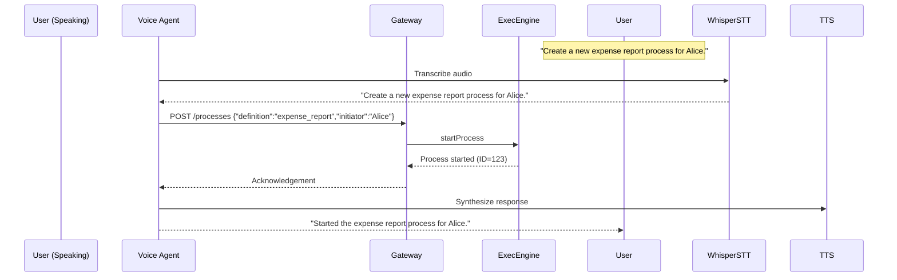

---

## API Gateway

**Role:** Front-door for clients. Routes to internal services, enforces auth (JWT), serves UI (optionally), and handles cross-cutting concerns.

**Gateway Structure (conceptual):**

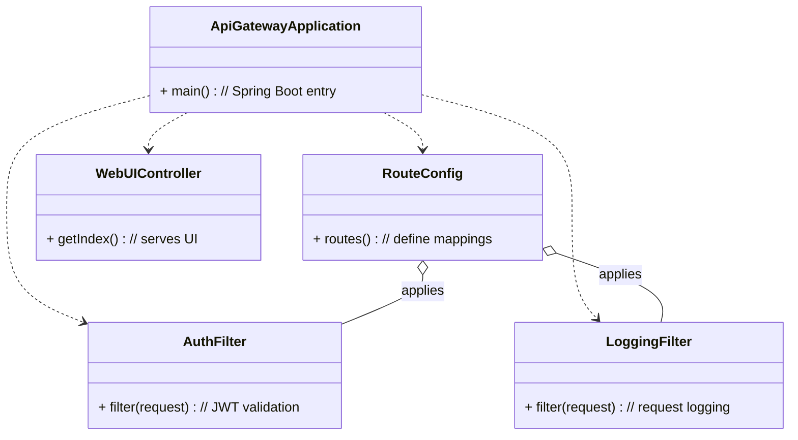

**Gateway Request Flow:**

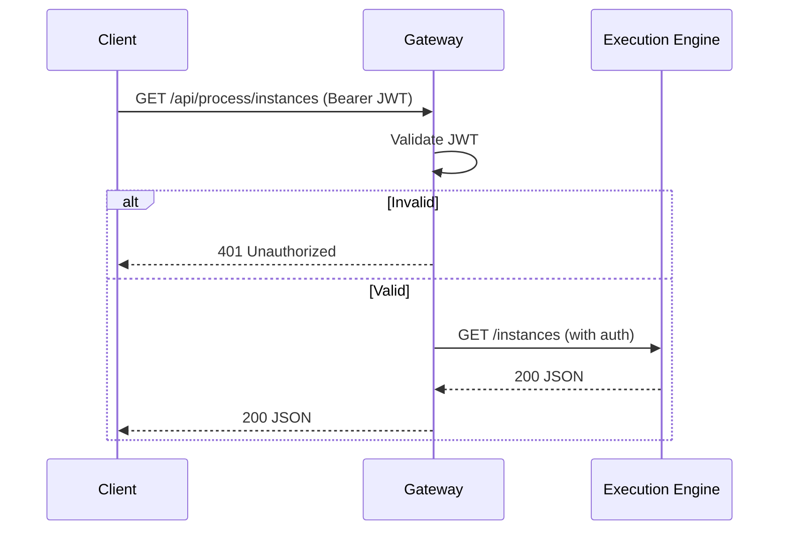

---

## Conclusion

Process-GPT integrates **deterministic BPM** with **agentic AI**. The **Execution Engine** provides structured workflows, the **Memento** service supplies knowledge retrieval, **CrewAI agents** enable multi-agent collaboration for complex tasks, the **OpenAI agent** offers efficient single-agent research, the **Voice Agent** adds natural speech interactions, and the **API Gateway** secures and unifies access. The architecture is modular, scalable on Kubernetes, and extensible via MCP tools and additional agents.
