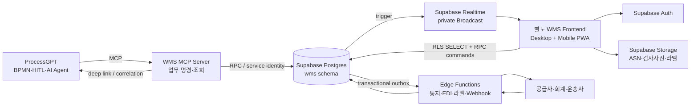
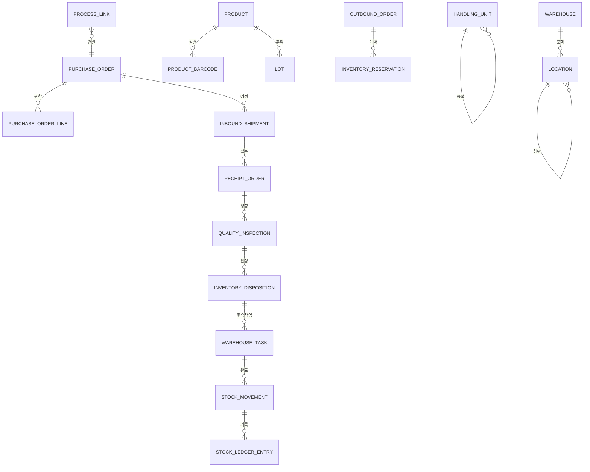

# 설계: Supabase 기반 ProcessGPT WMS·경량 구매 ERP

## 1. 설계 배경

대상 프로세스는 다음 업무를 하나의 실행 흐름으로 연결한다.

1. 재고가 최소 수량보다 낮아진 것을 감지한다.
2. 재고·수요·리드타임을 확인한다.
3. 구매 필요와 수량을 제안하고 RFQ를 만든다.
4. 관리자가 구매를 승인하거나 취소한다.
5. 승인된 RFQ를 PO로 확정하고 공급사에 알린다.
6. 공급사가 보낸 상품을 입하 접수한다.
7. 입고 수량과 품질을 검사한다.
8. 불합격품은 폐기·반품·재작업으로, 합격품은 선반 적치로 처리한다.
9. 적치가 완료된 수량만 판매·생산에 사용 가능한 재고로 전환한다.

기존에는 이 흐름의 실행 시스템이 Odoo였다. 새 설계에서는 ProcessGPT가 업무의 순서·담당자·승인을 오케스트레이션하고, WMS가 재고·구매·입출고의 트랜잭션 무결성과 현장 작업을 책임진다.

## 2. 근거가 된 WMS 업무 범위

설계 범위는 다음 공식 문서의 공통 기능을 기준으로 정했다.

- Odoo Inventory는 창고/로케이션, 다단계 입출고, putaway, replenishment, batch/cluster/wave picking, lot/serial, scrap, 바코드 기능을 WMS 범위로 다룬다: [Odoo Inventory](https://www.odoo.com/documentation/16.0/applications/inventory_and_mrp/inventory.html)
- Odoo의 3단계 입고는 `Input → Quality Control → Stock`을 분리하고, 품질 구역을 통과하기 전에는 재고를 사용할 수 없게 한다: [Odoo Three-step receipt](https://www.odoo.com/documentation/master/applications/inventory_and_mrp/inventory/shipping_receiving/daily_operations/receipts_three_steps.html)
- Odoo replenishment는 forecasted stock이 Min 아래로 내려가면 PO/MO를 제안 또는 생성하고 Max까지 보충한다: [Odoo Replenishment](https://www.odoo.com/documentation/master/applications/inventory_and_mrp/inventory/warehouses_storage/replenishment.html)
- Oracle WMS는 minimum capacity, percentage of max, reactive, order-based replenishment를 제공한다: [Oracle WMS Replenishment](https://docs.oracle.com/en/cloud/saas/warehouse-management/25d/owmol/overview-of-replenishment.html)
- Dynamics 365 WMS는 모바일 입고와 품질 샘플링, 합격/불합격 후속 이동, 주기 실사와 차이 검토를 통합한다: [Warehouse quality management](https://learn.microsoft.com/en-us/dynamics365/supply-chain/inventory/quality-management-for-warehouses-processes), [Cycle counting](https://learn.microsoft.com/en-us/dynamics365/supply-chain/warehousing/cycle-counting)
- GS1 Traceability Standard는 창고가 GTIN+lot과 팔레트/물류단위 SSCC의 연결을 기록하도록 정의한다: [GS1 Global Traceability Standard](https://www.gs1.org/standards/gs1-global-traceability-standard/current-standard)

## 3. 목표와 제외 범위

### 목표

- Odoo 없이 대상 BPMN의 모든 데이터 조회·명령을 실행한다.
- 일반 WMS가 요구하는 입고, 품질, 적치, 재고, 보충, 출고, 실사, 반품, 추적성을 제공한다.
- 재고 수량의 모든 변화를 원인 문서·작업자·시각·위치·lot/serial까지 설명할 수 있다.
- 데스크톱 운영자와 모바일 현장 작업자가 같은 실시간 업무 상태를 본다.
- 프로세스 작업과 WMS 문서를 `process_instance_id`, `activity_id`, `correlation_id`로 양방향 추적한다.
- 테넌트와 창고가 다른 사용자는 데이터와 Realtime 이벤트를 서로 볼 수 없다.
- 외부 요청 재시도와 현장 오프라인 재전송이 중복 재고 이동을 만들지 않는다.

### 제외 범위

- 총계정원장, 부가세 신고, 은행 조정, 급여, CRM, 제조 MRP 전체.
- 운송사 TMS의 배차 최적화와 실시간 차량 관제.
- 자동창고 설비 PLC/WCS의 저수준 제어.
- 수요예측 ML 모델 자체. 1차는 규칙·리드타임·과거 수요 기반 제안까지만 제공한다.
- 범용 BPM 엔진의 재구현. 승인과 예외 업무 순서는 ProcessGPT가 담당한다.

## 4. 책임 경계

| 구성요소 | 책임 | 책임지지 않는 것 |
|---|---|---|
| ProcessGPT | 프로세스 순서, AI 작업, HITL 승인, 담당자, SLA, 보상 흐름 | 재고 수불 정합성, 로케이션 용량 |
| WMS | 재고 원장, 구매·입고·검수·적치·출고 문서, 창고 작업, 추적성 | 범용 프로세스 모델링 |
| WMS MCP | ProcessGPT가 호출하는 안정된 업무 명령과 조회 도구 | 브라우저용 화면 상태 |
| WMS Frontend | 운영·현장 화면, 스캔, 작업 수행, 관리자 설정 | `service_role` 기반 직접 쓰기 |
| Supabase | Auth, Postgres, RLS, Realtime, Storage, Edge Functions | 프로세스 정의와 사람 업무 라우팅 |
| 외부 회계/TMS/공급사 | 회계 전표, 운송 실행, 견적·ASN 회신 | WMS 내부 재고 원장 |

## 5. 논리 아키텍처



### 아키텍처 결정

#### D1. 별도 WMS 프론트엔드

- 신규 앱 후보 위치는 `services/wms-frontend`이다.
- 기존 ProcessGPT의 Vue 3, TypeScript, Vite, Vuetify, Pinia, Playwright 경험을 재사용하되 빌드와 배포는 분리한다.
- 데스크톱 운영 화면과 모바일 PWA는 같은 코드베이스에서 반응형 shell과 역할별 route를 사용한다.
- ProcessGPT에는 WMS 문서 요약과 deep link만 노출한다. WMS 상세 화면을 ProcessGPT에 중복 구현하지 않는다.

#### D2. Postgres 원장이 단일 진실 원천

- 재고 수량의 진실 원천은 `stock_ledger_entries`이다.
- `inventory_balances`는 빠른 조회를 위한 동기 투영이며 임의 수정 API를 제공하지 않는다.
- 한 재고 이동은 하나의 `stock_movement`와 출발·도착 원장 entry를 동일 트랜잭션으로 기록한다.
- `on_hand`, `reserved`, `blocked`, `available`, `inbound`, `outbound`, `forecasted`를 서로 다른 필드로 구분한다.

```text
available = on_hand - reserved - blocked
forecasted = available + confirmed_inbound - committed_outbound
```

#### D3. 브라우저 쓰기는 명령 RPC를 통한다

- 단순 조회는 RLS가 적용된 view/PostgREST를 사용한다.
- 재고 이동, 예약, PO 확정, 입고 검증, 품질 판정, 폐기, 적치, 피킹, 실사 조정은 Postgres RPC 또는 Edge Function 명령만 사용한다.
- 명령은 `tenant_id`, `actor_id`, `idempotency_key`, `expected_version`, `correlation_id`를 검증하고 하나의 트랜잭션으로 처리한다.
- 브라우저는 `service_role` 키를 절대 보유하지 않는다.

#### D4. Realtime은 private Broadcast를 기본으로 한다

- Supabase는 확장성과 보안을 위해 Postgres Changes보다 Broadcast를 권장하므로 업무 상태 변경은 private tenant/warehouse topic으로 발행한다.
- topic 예시는 `tenant:{tenant_id}:warehouse:{warehouse_id}`이다.
- 이벤트 payload는 UI 갱신에 필요한 최소 식별자와 버전만 포함하고, 상세 데이터는 RLS 조회로 다시 가져온다.
- 스캔 응답처럼 즉시성이 필요한 명령 결과는 RPC 응답을 우선 사용하고 Broadcast는 다른 화면의 동기화에 사용한다.

#### D5. 외부 연동은 transactional outbox를 통한다

- 공급사 이메일, ASN 웹훅, 회계 이벤트, ProcessGPT signal은 DB 트랜잭션 안에서 `integration_outbox`에 기록한다.
- Edge Function/worker가 outbox를 전달하고 재시도·dead-letter 상태를 기록한다.
- 외부 전송 실패가 재고나 PO 트랜잭션 자체를 롤백하지 않는다.

#### D6. MCP 도구는 거친 업무 명령 단위로 제공한다

- 테이블 CRUD 도구를 노출하지 않는다.
- 각 도구는 하나의 업무 의도와 멱등성 경계를 가진다.
- 읽기 도구와 쓰기 도구를 분리하고, 쓰기 도구는 `dry_run`과 예상 변경 요약을 지원한다.
- 구매 승인·폐기·재고 조정처럼 중요한 명령은 ProcessGPT HITL 또는 WMS 권한 확인이 선행되어야 한다.

## 6. 프론트엔드 정보 구조

### 6.1 공통 shell

- 상단: 테넌트, 회사, 창고 선택기, 전역 검색, 스캐너 연결 상태, Realtime 상태, 알림.
- 좌측: 역할에 따른 메뉴.
- 우측 context panel: 현재 문서의 ProcessGPT 인스턴스, 관련 주문·작업·첨부·감사 이력.
- 모든 상세 화면은 문서 번호, 상태, 버전, 담당자, 마지막 변경 시각, `correlation_id`를 표시한다.

### 6.2 데스크톱 운영 화면

| Route | 핵심 화면 | 주요 사용자 |
|---|---|---|
| `/overview` | 재고 부족, 예정 입고, 지연 작업, 출고 SLA, 품질 격리 KPI | 관리자 |
| `/inventory/balances` | SKU·lot·상태·로케이션별 on-hand/available/reserved | 재고 관리자 |
| `/inventory/movements` | 수불 원장과 원인 문서 timeline | 감사·재고 관리자 |
| `/replenishment` | 부족 제안, Min/Max, 리드타임, 예상 품절일 | 구매 담당 |
| `/procurement/rfqs` | RFQ와 견적 비교 | 구매 담당 |
| `/procurement/purchase-orders` | 승인·확정·변경·입고 진척 | 구매 담당·승인자 |
| `/inbound/asns` | 공급사 ASN, 도크 일정, 예상 LPN | 입고 관리자 |
| `/inbound/receipts/:id` | 기대/실입고, 차이, 파손, 검사 필요 | 입고 담당 |
| `/quality/inspections` | 대기 검사, 샘플, 결과, 처분 | 품질 담당 |
| `/warehouse/tasks` | 작업 큐, 우선순위, 담당자, SLA, 예외 | 현장 관리자 |
| `/outbound/orders` | 출고 주문, 예약·할당, 부족 | 출고 관리자 |
| `/outbound/waves` | wave 구성, release, 보충 의존성 | 출고 관리자 |
| `/counts` | 실사 계획, 차이 검토·승인 | 재고 관리자 |
| `/returns` | 반품 접수와 처분 | 반품 담당 |
| `/trace` | GTIN·lot·serial·SSCC 계보와 회수 범위 | 품질·감사 |
| `/settings` | 창고, 위치, 규칙, 권한, 연동, 라벨 | 관리자 |

### 6.3 모바일 PWA 작업 화면

모바일 화면은 자유 탐색보다 “현재 작업의 다음 스캔”에 집중한다.

1. 로그인·창고 선택.
2. 내 작업 또는 system-directed 작업 claim.
3. 작업 시작 위치 스캔.
4. 상품/GTIN, lot/serial 또는 LPN/SSCC 스캔.
5. 수량·상태·예외 입력.
6. 목적 위치 또는 포장 단위 스캔.
7. 서버 검증 결과 확인.
8. 작업 완료 또는 예외 escalation.

오프라인 상태에서는 이미 내려받은 작업과 기준정보에 한해 스캔을 로컬 queue에 저장한다. 재연결 시 동일 `idempotency_key`로 순서대로 재전송하며, 서버 버전 충돌은 자동 덮어쓰지 않고 예외 화면으로 보낸다.

### 6.4 핵심 UX 원칙

- 색상만으로 상태를 구분하지 않고 텍스트·아이콘을 함께 표시한다.
- 수량을 입력하기 전에 UOM과 포장 환산을 항상 보여 준다.
- 위험한 명령은 “변경될 수량·위치·lot” preview 후 확정한다.
- 현장 오류는 기술 메시지 대신 “다른 lot입니다”, “이 위치에는 적치할 수 없습니다”처럼 행동 가능한 문장으로 보여 준다.
- 스캔 성공은 시각·소리·진동으로 확인하고, 중복 스캔은 조용히 누적하지 않는다.

## 7. 데이터 모델

### 7.1 공통 컬럼

업무 테이블은 기본적으로 다음 필드를 가진다.

| 필드 | 의미 |
|---|---|
| `id` | UUID 또는 업무 식별자 |
| `tenant_id` | 테넌트 경계 |
| `company_id` | 법인/회사 |
| `warehouse_id` | 창고 범위, 해당하지 않으면 null |
| `status` | 명시적 상태 enum |
| `version` | optimistic concurrency version |
| `created_at`, `created_by` | 생성 감사 |
| `updated_at`, `updated_by` | 변경 감사 |
| `correlation_id` | 프로세스·외부 연동 상관관계 |
| `source_system`, `source_ref` | Odoo/EDI/수동 등 원천 |

### 7.2 테이블 그룹

#### 테넌트·권한

- `tenants`, `companies`
- `memberships`, `role_assignments`, `warehouse_scopes`
- `service_identities`, `api_clients`

#### 창고 기준정보

- `warehouses`, `zones`, `locations`, `docks`
- `location_capacities`, `location_compatibility_rules`
- `putaway_rules`, `removal_rules`

#### 상품·공급사 기준정보

- `products`, `product_barcodes`, `uoms`, `uom_conversions`
- `packaging_types`, `product_packagings`
- `suppliers`, `supplier_items`, `purchase_terms`
- `lots`, `serial_numbers`, `handling_units`

`handling_units`는 LPN/SSCC와 중첩 포장 구조를 표현하며 `parent_handling_unit_id`를 가진다.

#### 재고

- `stock_movements`: 업무상 이동 header.
- `stock_ledger_entries`: 위치·상품·lot/serial·상태별 signed quantity.
- `inventory_balances`: 원장 투영.
- `inventory_reservations`: 출고·작업별 예약.
- `inventory_holds`: 품질·법규·분쟁 격리.
- `inventory_adjustments`: 실사·관리 조정 문서.

주요 재고 상태:

```text
EXPECTED, RECEIVING, QC, AVAILABLE, RESERVED, PICKED,
PACKED, IN_TRANSIT, HOLD, DAMAGED, RETURNED, SCRAP
```

#### 재보충·구매

- `reorder_rules`, `replenishment_suggestions`
- `purchase_requests`, `rfqs`, `rfq_lines`
- `supplier_quotes`, `supplier_quote_lines`
- `purchase_orders`, `purchase_order_lines`
- `purchase_approvals`, `supplier_notifications`

#### 입고·품질·적치

- `inbound_shipments`, `inbound_shipment_lines`
- `receipt_orders`, `receipt_lines`, `receipt_exceptions`
- `quality_plans`, `quality_rules`, `quality_inspections`, `quality_results`
- `nonconformances`, `inventory_dispositions`, `scrap_orders`, `supplier_returns`

#### 출고·반품

- `outbound_orders`, `outbound_order_lines`
- `allocation_runs`, `allocations`, `waves`
- `pick_lists`, `pick_lines`
- `packages`, `package_contents`, `shipments`
- `return_authorizations`, `return_receipts`, `return_dispositions`

#### 창고 작업·운영

- `warehouse_tasks`, `warehouse_task_steps`, `task_exceptions`
- `cycle_count_plans`, `cycle_count_tasks`, `cycle_count_results`
- `process_links`, `integration_outbox`, `integration_inbox`
- `idempotency_records`, `audit_events`, `notifications`

### 7.3 핵심 관계



## 8. 상태 모델

### 8.1 구매

```text
DRAFT_RFQ → SENT → QUOTED → TO_APPROVE → APPROVED
→ CONFIRMED_PO → PARTIALLY_RECEIVED → RECEIVED → CLOSED
                       ↘ CANCELLED
```

확정된 PO의 수량·가격·납기 변경은 기존 버전을 덮어쓰지 않고 변경 이력과 재승인 여부를 남긴다.

### 8.2 입고

```text
EXPECTED → ARRIVED → RECEIVING → RECEIVED
→ QC_PENDING → QC_PARTIAL/QC_COMPLETED
→ PUTAWAY_PENDING → PUTAWAY_COMPLETED → CLOSED
```

### 8.3 품질 처분

```text
HOLD → PASSED → AVAILABLE
HOLD → FAILED → RETURN_TO_VENDOR | REWORK | SCRAP
```

### 8.4 창고 작업

```text
OPEN → ASSIGNED → CLAIMED → IN_PROGRESS → COMPLETED
                         ↘ SUSPENDED → IN_PROGRESS
                         ↘ EXCEPTION → RESOLVED/CANCELLED
```

### 8.5 출고

```text
CREATED → RELEASED → ALLOCATED → PICKING → PICKED
→ PACKING → PACKED → SHIPPED → CLOSED
```

## 9. 명령·조회 계약

### 9.1 Supabase 읽기 표면

RLS가 적용된 view를 제공한다.

- `wms.inventory_availability_v`
- `wms.inventory_trace_v`
- `wms.replenishment_workbench_v`
- `wms.inbound_progress_v`
- `wms.task_queue_v`
- `wms.outbound_progress_v`
- `wms.operations_kpi_v`

### 9.2 RPC 명령

| RPC | 목적 |
|---|---|
| `wms_check_stock` | SKU·창고·시점별 수량과 부족 원인 조회 |
| `wms_generate_replenishment` | 부족 제안 생성 |
| `wms_create_rfq` | 구매 필요를 RFQ로 전환 |
| `wms_submit_purchase_approval` | 구매 승인/반려 |
| `wms_confirm_purchase_order` | 승인된 RFQ/견적을 PO로 확정 |
| `wms_register_arrival` | ASN/PO 입하 도착 등록 |
| `wms_receive_handling_unit` | LPN/SSCC·상품·수량 입고 |
| `wms_record_quality_result` | 검사 결과와 증빙 기록 |
| `wms_apply_disposition` | 합격·폐기·반품·재작업 처분 |
| `wms_create_putaway_tasks` | 적치 위치 추천과 작업 생성 |
| `wms_confirm_task_step` | 스캔 기반 작업 단계 완료 |
| `wms_allocate_outbound` | 출고 예약·할당 |
| `wms_release_wave` | wave와 피킹 작업 생성 |
| `wms_post_cycle_count` | 실사 차이 승인 후 원장 반영 |

모든 쓰기 명령은 다음 envelope를 받는다.

```json
{
  "tenant_id": "tenant-key",
  "warehouse_id": "uuid",
  "actor_id": "auth-user-or-service-id",
  "idempotency_key": "uuid",
  "expected_version": 3,
  "correlation_id": "process-instance-or-external-id",
  "input": {}
}
```

응답은 `result`, `document`, `version`, `events`, `warnings`, `links`를 반환한다. 충돌은 `409`, 업무 규칙 위반은 `422`, 권한 위반은 `403`으로 구분한다.

## 10. WMS MCP 계약

### 10.1 도구 목록

| MCP 도구 | 읽기/쓰기 | BPMN 대응 |
|---|---|---|
| `wms.inventory.get_availability` | 읽기 | 재고·수요 확인 |
| `wms.replenishment.create_proposal` | 쓰기 | 재보충 판단·RFQ 제안 |
| `wms.procurement.create_rfq` | 쓰기 | `create_rfq` |
| `wms.procurement.request_approval` | 쓰기 | 발주 승인 HITL 생성 |
| `wms.procurement.confirm_po` | 쓰기 | `confirm_po` |
| `wms.procurement.notify_supplier` | 쓰기 | 공급사 출하 통보 |
| `wms.inbound.register_arrival` | 쓰기 | 하역장 수행 시작 |
| `wms.inbound.receive` | 쓰기 | 입고 수량 등록 |
| `wms.quality.inspect` | 쓰기 | `validate_receipt` |
| `wms.inventory.scrap` | 쓰기 | `scrap` |
| `wms.inventory.return_to_supplier` | 쓰기 | 불합격 반품 |
| `wms.putaway.create_tasks` | 쓰기 | `putaway` |
| `wms.documents.get_status` | 읽기 | 프로세스 상태 재동기화 |
| `wms.commands.compensate` | 쓰기 | 취소·보상 |

### 10.2 MCP 쓰기 안전장치

- `dry_run=true`이면 예상 문서·재고 변화만 반환한다.
- 실제 실행은 `idempotency_key`가 필수다.
- 도구 결과는 사람이 읽는 설명뿐 아니라 구조화된 `document_id`, `status`, `next_actions`, `warnings`, `deep_link`를 반환한다.
- 구매 승인, 폐기, 실사 조정은 승인 token 또는 권한이 없으면 `requires_human_approval`을 반환한다.
- 이미 완료된 동일 명령 재호출은 같은 결과를 반환하고 새 수불을 만들지 않는다.

## 11. ProcessGPT 연동 상세

### 11.1 대상 프로세스 매핑

| 프로세스 활동 | WMS 계약 | 결과 |
|---|---|---|
| 재고·수요 확인 | `wms.inventory.get_availability` | on-hand, available, forecasted, shortage |
| 재보충 판단·RFQ 제안 | `wms.replenishment.create_proposal` | 제안 수량, 사유, 공급사 후보 |
| 발주 승인 | ProcessGPT HITL + `wms.procurement.request_approval` | 승인/반려와 승인자 |
| PO 확정 | `wms.procurement.confirm_po` | PO 번호, 납기, 예상 입고 |
| 공급사 출하 통보 | outbox/Edge Function | ASN 또는 출하 예정 |
| 하역장 수행 | `wms.inbound.register_arrival`, `wms.inbound.receive` | 실제 수량, LPN/SSCC, 예외 |
| 입고 검수 | `wms.quality.inspect` | 합격/불합격/부분 합격 |
| 폐기 처리 | `wms.inventory.scrap` | 폐기 원장, 증빙 |
| 선반 배치·재고 반영 | `wms.putaway.create_tasks` + 작업 완료 | AVAILABLE 재고 |

### 11.2 상관관계

`process_links`는 다음 식별자를 연결한다.

- `process_definition_id`
- `process_instance_id`
- `activity_id`
- `workitem_id`
- `wms_document_type`
- `wms_document_id`
- `correlation_id`

WMS 상세 화면은 ProcessGPT 인스턴스로, ProcessGPT 워크아이템은 WMS 문서로 deep link를 제공한다.

### 11.3 업무 이벤트

```text
wms.inventory.below_min
wms.replenishment.proposed
wms.rfq.created
wms.purchase.approval_requested
wms.purchase.approved
wms.po.confirmed
wms.inbound.arrived
wms.receipt.completed
wms.quality.passed
wms.quality.failed
wms.scrap.completed
wms.putaway.completed
wms.outbound.short_pick
wms.task.exception
```

이벤트에는 `event_id`, `tenant_id`, `warehouse_id`, `aggregate_type`, `aggregate_id`, `aggregate_version`, `occurred_at`, `correlation_id`, `payload`가 포함된다.

## 12. 권한 모델

| 역할 | 주요 권한 |
|---|---|
| `WMS_ADMIN` | 모든 설정·사용자·연동 |
| `WAREHOUSE_MANAGER` | 창고 운영·작업 배정·예외 해결 |
| `INBOUND_OPERATOR` | 입하·입고 스캔 |
| `QUALITY_INSPECTOR` | 검사·격리·처분 제안 |
| `INVENTORY_CONTROLLER` | 실사·조정 승인·원장 조회 |
| `PROCUREMENT_BUYER` | RFQ·견적·PO 작성 |
| `PURCHASE_APPROVER` | 임계금액 이상 구매 승인 |
| `PICKER_PACKER` | 피킹·포장·출하 작업 |
| `RETURNS_OPERATOR` | 반품 접수·처분 |
| `AUDITOR` | 읽기·감사·추적성 |
| `PROCESS_AGENT` | 허용된 MCP 명령만 실행 |

RLS는 `tenant_id`뿐 아니라 `warehouse_scopes`와 역할을 함께 검사한다. `PROCESS_AGENT`는 사용자 화면 권한과 분리된 service identity이며 허용 tool scope를 가진다.

## 13. Storage 설계

비공개 bucket:

- `wms-inbound-documents`: ASN, packing list, 송장.
- `wms-quality-evidence`: 검사 사진, 측정 파일, 인증서.
- `wms-labels`: SSCC, lot, shipping label PDF/ZPL.
- `wms-audit-exports`: 감사·회수 보고서.

경로는 `{tenant_id}/{warehouse_id}/{document_type}/{document_id}/...` 형식을 사용한다. `storage.objects` RLS가 테넌트·창고 scope와 문서 권한을 검사하며, signed URL은 짧은 만료시간으로 발급한다.

## 14. 동시성·멱등성·정합성

- 예약·피킹·수불 명령은 필요한 balance row를 잠그고 음수 가용재고를 허용하지 않는다.
- 작업 claim은 `FOR UPDATE SKIP LOCKED` 또는 동등한 원자 연산으로 한 작업자를 선택한다.
- `idempotency_records`는 명령명+테넌트+키를 유일하게 저장하고 이전 응답 hash를 보존한다.
- 문서 변경은 `expected_version` 불일치 시 `409`를 반환한다.
- 원장 entry는 수정·삭제하지 않는다. 오류는 반대 방향 correction movement로 보정한다.
- 모든 외부 inbox 이벤트는 `external_event_id` unique 제약으로 중복을 제거한다.

## 15. 감사와 추적성

- 모든 명령은 actor, 권한, 전후 상태, 원인 문서, correlation을 `audit_events`에 기록한다.
- 품질·폐기·실사 조정은 사유 코드와 증빙이 필수다.
- GTIN+lot/serial에서 입고 ASN, 공급사, SSCC, 이동, 검사, 출고 고객까지 양방향 계보를 조회할 수 있어야 한다.
- SSCC에서 포함된 포장·상품·lot을 조회하고, 포장 재구성 시 부모·자식 이력을 유지한다.
- 회수 조회는 영향 출고·고객·현재 위치·격리 완료 여부를 반환한다.

## 16. 비기능 목표

다음은 1차 운영 sizing 가정이며 실제 고객 규모에 따라 재확정한다.

- 테넌트당 최대 100개 창고, 100,000 SKU, 연 10,000,000 원장 entry.
- 창고당 동시 현장 사용자 300명.
- 일반 목록·상세 조회 p95 2초 이내.
- 온라인 스캔 명령 응답 p95 800ms 이내.
- 동일 창고 화면의 상태 변화 Broadcast 도착 p95 2초 이내.
- 재고 이동과 예약 명령은 원자적이며 부분 성공을 허용하지 않는다.
- 운영 핵심 명령 성공률 99.9% 목표.
- 감사 데이터 보존 기간은 기본 7년이며 테넌트 정책으로 조정한다.
- PITR/백업 정책과 복구 훈련은 Supabase 배포 등급에 맞춰 운영 문서에 명시한다.

## 17. Odoo 데이터 매핑과 전환

| Odoo | 신규 WMS |
|---|---|
| `stock.warehouse` | `warehouses` |
| `stock.location` | `locations` |
| `product.product` | `products` |
| `stock.lot` | `lots` / `serial_numbers` |
| `stock.quant` | `inventory_balances` 개시값 |
| `stock.move`, `stock.move.line` | `stock_movements`, `stock_ledger_entries` |
| `purchase.order` | `purchase_orders` |
| `purchase.order.line` | `purchase_order_lines` |
| `stock.picking`(incoming) | `receipt_orders` |
| `stock.picking`(outgoing) | `outbound_orders` / `shipments` |
| `stock.scrap` | `scrap_orders` + 원장 |
| package/LPN | `handling_units` |

### 전환 단계

1. **기준정보 이관**: 창고·위치·상품·UOM·포장·공급사·lot/serial.
2. **개시 재고**: cutover 시점 quant를 `OPENING_BALANCE` 원장으로 기록하고 총량·위치·lot을 대조한다.
3. **shadow 검증**: Odoo 이벤트를 읽어 새 WMS 투영과 매일 비교하되 새 WMS는 업무 명령을 실행하지 않는다.
4. **입고·구매 pilot**: 한 창고와 선택 SKU에서 RFQ–PO–입고–검수–적치를 신규 WMS로 실행한다.
5. **MCP cutover**: ProcessGPT 도구 구성을 Odoo MCP에서 WMS MCP로 전환한다.
6. **출고·실사 cutover**: wave/pick-pack-ship과 cycle count를 전환한다.
7. **Odoo 읽기 전용**: 규정상 필요한 기간 동안 과거 문서 조회만 유지한다.

cutover gate는 SKU·위치·lot별 on-hand 합계, open PO, open receipt, open outbound, 예약 총량이 허용 오차 내 일치할 때만 통과한다.

## 18. 구현 위치 후보

이 항목은 설계 검토를 위한 후보이며 스펙의 외부 계약은 아니다.

- `services/wms-frontend`: 별도 Vue 3/Vite/PWA.
- `services/wms-mcp`: FastMCP 기반 ProcessGPT 도구.
- `supabase/migrations`: `wms` 스키마, RLS, RPC, trigger, view.
- `supabase/functions/wms-*`: 통지, inbound webhook, label, outbox delivery.
- `openspec/specs/wms_*/e2e`: capability별 Playwright/API E2E.

## 19. 열린 질문

- 1차 고객의 재고평가 방식이 이동평균, FIFO 원가, 표준원가 중 무엇인가.
- 공급사 협업을 이메일 링크로 시작할지 별도 supplier portal로 시작할지.
- 출고 주문 원천이 ProcessGPT, 외부 OMS, CSV, API 중 무엇인지와 우선순위.
- 냉장·위험물·유통기한 규칙이 필요한 창고 범위.
- 한국 전자세금계산서·회계 전표까지 이번 제품이 소유해야 하는지, 외부 회계 시스템에 이벤트만 전달할지.
- 무선 음영 구역에서 허용할 오프라인 작업 종류와 최대 보류 시간.
